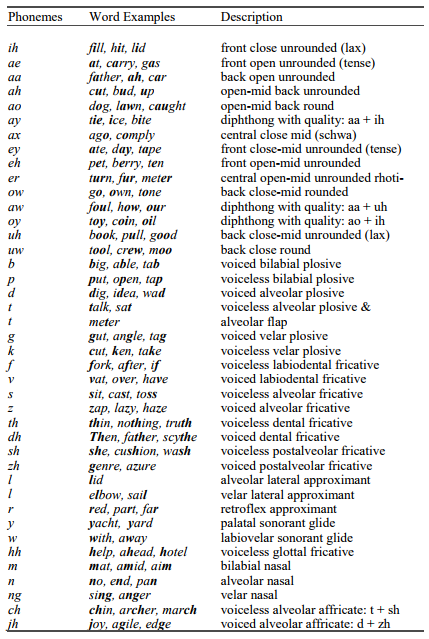

# Module 1: Introduction
## Table of Contents

- [Phonetics](#phonetics)
  - [Overview](#overview)
  - [Words and Syntax](#words-and-syntax)
  - [Syllables and words](#syllables-and-words)
  - [Syntax and Semantics](#syntax-and-semantics)
- [Measuring Performance](#measuring-performance)
  - [WER](#wer)
  - [Significance Testing](#significance-testing)
  - [Real-time Factor](#real-time-factor)
- [The Fundamental Equation](#the-fundamental-equation)
- [Quiz](#quiz)
- [Lab](#lab) 

## Introduction  

Developing and understanding Automatic Speech Recognition systems is an interdisciplinary activity, taking expertise in linguistics, computer science, and electrical engineering.

This course will focus on the structure of American English speech. Other languages may differ in more or less significant ways, from the use of tone to convey meaning to the sets of meaningful distinctions in the sound inventory of the language. 

Speech production process is how do human produce speech and this leads to the study of phonetics. Speech has a hierarchical structure. At the top level, speech is made up of utterances. Utterances can be broken down into words, which can be broken down into syllables, which can be broken down into phones. Phones are the acoustic realizations of phonemes, which are the atomic units of speech sounds. Phonemes are the smallest units of sound that can change meaning in a language. For example, the words "bat" and "pat" differ in their initial phoneme, /b/ vs /p/, which changes the meaning of the word.  

There are three basic parts of an automatic speech recognition system: the acoustic model, the language model, and the decoder. The acoustic model is responsible for modeling how sequences of words are converted into acoustic realizations and then into the acoustic observations presented to the ASR system. The language model assigns a probability to every possible word sequence. It is trained on sequences of words that are expected to be like those the final system will encounter in everyday use. The decoder searches for the best word sequence given the acoustic observations and the models.

## Phonetics

### Overview  
Phonetics is the part of linguistics that focuses on the study of the sounds produced by human speech. It encompasses their production (through the human vocal apparatus), their acoustic properties, and perception. There are three basic branches of phonetics, all of which are relevant to automatic speech recognition.

- Articulatory phonetics focuses on the production of speech sounds via the vocal tract and various articulators

- Acoustic phonetics focuses on the transmission of speech sounds from a speaker to a listener

- Auditory phonetics focuses on the reception and perception of speech sounds by the listener.

The atomic unit of a speech sound is called a phoneme. Words are comprised of one or more phonemes in sequence. The acoustic realization of a phoneme is called a phone. Below is a table of phonemes of U.S. English and common realizations.

One major way to categorize phonemes is by dividing them into vowels and consonants.

**Vowels** can be distinguished by two attributes. First, they are voiced sounds, meaning that the airflow from the vocal cords into the mouth cavity is created by the vibration of the vocal cords at a particular fundamental frequency (or pitch). Second, the tongue does not in any way form a constriction of airflow during production. The placement of the tongue, lips, and jaw distinguishes different vowel sounds from each other. These different positions form different resonances inside the vocal tract called formants and the resonant frequencies of these formants characterizes the different vowel sounds.

**Consonants** are characterized by significant constriction of airflow in the airway or mouth. Like vowels, some consonants can be voiced, while others are unvoiced. Unvoiced phonemes do not engage the vocal cords and, therefore, do not have a fundamental frequency or pitch. Some consonant phonemes occur in pairs that differ only in whether they are voiced or unvoiced but are otherwise identical. For example, the sounds /b/ and /p/ have identical articulatory characteristics (your mouth, tongue, and jaw are in the same position for both), but the former is voiced, and the latter is unvoiced. The sounds /d/ and /t/ are another such pair.

One important aspect of phonemes is that their realization can change depending on the surrounding phones. This is called phonetic context, and it is caused by a phenomenon called coarticulation. The process of producing these sounds in succession changes their characteristics. Modified versions of a phoneme caused by coarticulation are called allophones.

All state-of-the-art speech recognition systems use this context-dependent nature of phonemes to create a detailed model of phonemes in their various phonetic contexts.

### Words and Syntax

#### Syllables and words
A syllable is a sequence of speech sounds composed of a nucleus phone and optional initial and final phones. The nucleus is typically a vowel or syllabic consonant and is the voiced sound that can be shouted or sung.

For example, the English word “bottle” contains two syllables. The first syllable has three phones, which are “b aa t” in the Arpabet phonetic transcription code. The “aa” is the nucleus, the “b” is a voiced consonant initial phone, and the “t” is an unvoiced consonant final phone. The second syllable is consists  of the syllabic consonant "l."

A word can also be composed of a single syllable, which itself is a single phoneme, e.g., "Eye," "uh," or "eau."

In speech recognition, syllable units are rarely considered, and words are commonly tokenized into constituent phonemes for modeling.

#### Syntax and Semantics
Syntax describes how sentences can be put together given words and rules that define allowable grammatical constructs. Semantics generally refers to the way that meaning is attributed to the words or phrases in a sentence. Both syntax and semantics are a major part of natural language processing, but neither plays a major role in speech recognition.  

## Measuring Performance 

### WER 
When we build and experiment with speech recognition systems, it is obviously very important to measure performance. Because speech recognition is a sequence classification task (in contrast to image labeling, where samples are independent), we must consider the entire sequence when we measure error.

The most common metric for speech recognition accuracy is the Word Error Rate (WER). There are three types of errors a system can make: a substitution, where one word is incorrectly recognized as a different word, a deletion, where no word is hypothesized when the reference transcription has one, and an insertion where the hypothesized transcription inserts extra words not present in the reference. The overall WER can be computed as

$$
WER = \frac{N_{\text{sub}} + N_{\text{ins}} + N_{\text{del}}}{N_{\text{ref}}}
$$

where $N_{\text{sub}}$, $N_{\text{ins}}$, and $N_{\text{del}}$ are the number of substitutions, insertions, and deletions, respectively, and $N_{\text{ref}}$ is the number of words in the reference transcription.

The WER is computed using a [string edit distance](https://en.wikipedia.org/wiki/Edit_distance) between the reference transcription and the hypothesized transcription. String edit distance can be efficiently computed using dynamic programming. Because string edit distance can be unreliable over a long body of text, we typically accumulate the error counts on a sentence-by-sentence basis and these counts are aggregated overall sentences in the test set to compute the overall WER.

In the example below, the hypothesis “how never a little later he had a comfortable chat” is measured against the reference “however a little later we had a comfortable chat” to reveal two substitution errors, one insertion error, and one deletion error.

| Reference	| Hypothesis | Error |
|-----------|------------|-------|
however	| how	| Substitution
||never	| Insertion |
 a	| a	||
little	| little	||
later	| later	||
we	| he	| Substitution
had	| had	||
a	|	| Deletion
comfortable	| comfortable	||
chat	| chat	||

The WER for this example is 4/7 = 0.4444 or 44.44%. It can be calculated as follows:

$$
WER = \frac{2 + 1 + 1}{9} = 0.4444 
$$

In some cases, the cost of the three different types of errors may not be equivalent. In this case, the edit distance computation can be adjusted accordingly.

Sentence error rate (SER) is a less commonly used evaluation metric that treats each sentence as a single sample that is either correct or incorrect. If any word in the sentence is hypothesized incorrectly, the sentence is judged incorrect. SER is computed simply as the proportion of incorrect sentences to total sentences.

## Significance testing 

Statistical significance testing involves measuring to what degree the difference between two experiments (or algorithms) can be attributed to actual differences in the two algorithms or is merely the result of inherent variability in the data, experimental setup, or other factors. The idea of statistical significance underlies all pattern classification tasks. However, the way statistical significance is measured is task-dependent. At the center of most approaches is the notion of a “hypothesis test” in which there is a “null” hypothesis. The question then becomes, with what confidence can you argue that the null hypothesis can be rejected?

For speech recognition, the most commonly used measure to compare two experiments is called the Matched Pairs Sentence-Segment Word Error (MAPSSWE) Test, commonly shortened to just the Matched Pairs Test. It was suggested for speech recognition evaluations by [Gillick et al.](http://citeseerx.ist.psu.edu/viewdoc/summary?doi=10.1.1.296.4438).

In this approach, the test set is divided into segments with the assumption that errors in one segment are statistically independent from each other. This assumption is well-matched with typical speech recognition experiments where many test utterances are run through the recognizer one by one. Given the utterance-level error count from the WER computation described above, constructing a matched pairs test is straightforward. More details of the algorithm can be found in [Pallet et al.](https://doi.org/10.1109/ICASSP.1990.115546).

### Real-time Factor

Besides accuracy, there may be computational requirements that impact performance, such as processing speed or latency. Decoding speed is usually measured with respect to a real-time factor (RTF). An RTF of 1.0 means that the system processes the data in real-time and takes ten seconds to process the audio.

$$
RTF = \frac{\text{Total processing time}}{\text{Total audio time}} 
$$

Factors above 1.0 indicate that the system needs more time to process the data. For some applications, this may be acceptable. For instance, when creating a transcription of a meeting or lecture, it may be more important to take more time and produce accurate transcriptions than to get the transcriptions quickly.

When the RTF is below 1.0, the system processes the data more quickly than it arrives. This can be useful when more than one system runs on the same machine. In that case, multithreading can effectively use one machine to process multiple audio sources in parallel. RTF below 1.0 also indicates that the system can “catch up” to real-time in online streaming applications. For instance, when performing a remote voice query on the phone, network congestion can cause gaps and delays in receiving the audio at the server. If the ASR system can process data faster than in real-time, it can catch up after the data arrives, hiding the latency behind the speed of the recognition system.

In general, any ASR system can be tuned to tradeoff speed for accuracy. But there is a limit. For a given model and test set, the speed-accuracy graph has an asymptote that is impossible to cross, even with unlimited computing power. The remaining errors can be entirely ascribed to modeling errors. Once the search finds the best result according to the model, further processing will not improve the accuracy.

## The Fundamental Equation

Speech recognition is cast as a statistical optimization problem. Specifically, for a given sequence of observations $\mathbf{O} = \lbrace O_{1},\ldots,O_{N} \rbrace$, we seek the most likely word sequence $\mathbf {W } =\lbrace W_{1},\ldots,W_{M} \rbrace$. That is, we are looking for the word sequence which maximizes the posterior probability $P(\mathbf{W}\vert\mathbf{O})$. Mathematically, this can be expressed as:

$$\hat{W} = \mathrm{arg\,max}_{W}P(W|O)$$

To solve this expression, we employ the Bayes rule,

$$
P\left( W \middle| O \right) = \frac{P\left( O \middle| W \right)P\left( W \right)}{P(O)}.
$$

Because the word sequence does not depend on the marginal probability of the observation $P(O)$, this term can be ignored. Thus, we can rewrite this expression as

$$\hat{W} = \mathrm{arg\,max}_{W}P\left( O \middle| W \right)P(W)
$$

This is known as the fundamental equation of speech recognition. The speech recognition problem can be cast as a search over this joint model for the best word sequence.

The equation has a component $P(O\vert W)$ known as an acoustic model that describes the distribution over acoustic observations $O$ given the word sequence $W$. The acoustic model is responsible for modeling how sequences of words are converted into acoustic realizations and then into the acoustic observations presented to the ASR system. Acoustics and acoustic modeling are covered in Modules 2 and 3 of this course.

The equation has a component $P(W)$ called a language model based solely on the word sequence $W$. The language model assigns a probability to every possible word sequence. It is trained on sequences of words that are expected to be like those the final system will encounter in everyday use. A language model trained on English text will probably assign a high value to the word sequence “I like turtles” and a low value to “Turtles sing table.” The language model steers the search towards word sequences that follow the same patterns as in the training data. Language models can also be seen in purely text-based applications, such as the autocomplete field in modern web browsers. Module 4 of this course is dedicated to language modeling.

For a variety of reasons, building a speech recognition engine is much more complicated than this simple equation implies. In this course, we will describe how these models are constructed and used together in modern speech recognition systems.

## Quiz

Test your understanding of the fundamentals of speech recognition. Select your answers and press **Check answers** &mdash; correct options are highlighted and a short explanation appears for each question.

<form id="srq-form" onsubmit="return false;">
<fieldset class="srq-q" data-type="single" data-correct="0">
  <legend>Question 1</legend>
  
The atomic unit of a speech sound is the phoneme. What is the acoustic realization of a phoneme called? (Choose one)

  <label><input type="radio" name="q1" value="0"> A phone</label>
  <label><input type="radio" name="q1" value="1"> An allophone</label>
  <label><input type="radio" name="q1" value="2"> A syllable</label>
  <label><input type="radio" name="q1" value="3"> A formant</label>
  
The <strong>phone</strong> is the acoustic realization of a phoneme; context-dependent variants caused by coarticulation are called allophones.

</fieldset>
<fieldset class="srq-q" data-type="single" data-correct="1">
  <legend>Question 2</legend>
  
Which statement best characterizes vowels? (Choose one)

  <label><input type="radio" name="q2" value="0"> They are unvoiced and constrict the airflow</label>
  <label><input type="radio" name="q2" value="1"> They are voiced and produced without constricting the airflow</label>
  <label><input type="radio" name="q2" value="2"> They never have a fundamental frequency</label>
  <label><input type="radio" name="q2" value="3"> They are produced with full closure of the vocal tract</label>
  
Vowels are <strong>voiced</strong> (vocal-cord vibration) and produced <strong>without a constriction</strong> of airflow; tongue/lip/jaw position sets the formants.

</fieldset>
<fieldset class="srq-q" data-type="single" data-correct="1">
  <legend>Question 3</legend>
  
The sounds /b/ and /p/ have identical articulation but differ in what respect? (Choose one)

  <label><input type="radio" name="q3" value="0"> Place of articulation</label>
  <label><input type="radio" name="q3" value="1"> One is voiced, the other is unvoiced</label>
  <label><input type="radio" name="q3" value="2"> One is a vowel, the other a consonant</label>
  <label><input type="radio" name="q3" value="3"> Nothing &mdash; they are identical</label>
  
/b/ is voiced and /p/ is unvoiced; the same holds for the /d/&ndash;/t/ pair.

</fieldset>
<fieldset class="srq-q" data-type="multi" data-correct="0,1,2">
  <legend>Question 4</legend>
  
Word Error Rate (WER) counts which kinds of errors? (Choose all that apply)

  <label><input type="checkbox" name="q4" value="0"> Substitutions</label>
  <label><input type="checkbox" name="q4" value="1"> Insertions</label>
  <label><input type="checkbox" name="q4" value="2"> Deletions</label>
  <label><input type="checkbox" name="q4" value="3"> Transpositions</label>
  
WER = (Nsub + Nins + Ndel) / Nref. Transpositions are not a separate WER error type.

</fieldset>
<fieldset class="srq-q" data-type="single" data-correct="0">
  <legend>Question 5</legend>
  
How is WER computed between the reference and the hypothesis? (Choose one)

  <label><input type="radio" name="q5" value="0"> Using a string edit distance computed with dynamic programming</label>
  <label><input type="radio" name="q5" value="1"> Using the Fast Fourier Transform</label>
  <label><input type="radio" name="q5" value="2"> Using Viterbi beam search</label>
  <label><input type="radio" name="q5" value="3"> Using k-means clustering</label>
  
WER uses a <strong>string edit distance</strong>, efficiently computed with dynamic programming, accumulated per sentence.

</fieldset>
<fieldset class="srq-q" data-type="single" data-correct="1">
  <legend>Question 6</legend>
  
When is a sentence counted as incorrect for Sentence Error Rate (SER)? (Choose one)

  <label><input type="radio" name="q6" value="0"> Only if every word is wrong</label>
  <label><input type="radio" name="q6" value="1"> If any single word is hypothesized incorrectly</label>
  <label><input type="radio" name="q6" value="2"> If more than half the words are wrong</label>
  <label><input type="radio" name="q6" value="3"> If the sentence length differs from the reference</label>
  
SER treats a sentence as wrong if <strong>any</strong> word is incorrect; it is the fraction of incorrect sentences.

</fieldset>
<fieldset class="srq-q" data-type="single" data-correct="1">
  <legend>Question 7</legend>
  
A Real-Time Factor (RTF) below 1.0 indicates that the system&hellip; (Choose one)

  <label><input type="radio" name="q7" value="0"> Processes audio slower than real time</label>
  <label><input type="radio" name="q7" value="1"> Processes the audio faster than its length</label>
  <label><input type="radio" name="q7" value="2"> Cannot process streaming audio</label>
  <label><input type="radio" name="q7" value="3"> Requires the audio to be under one second</label>
  
RTF = processing time / audio time. Below 1.0 means the recognizer runs <strong>faster than real time</strong>, so it can catch up to streaming input.

</fieldset>
<fieldset class="srq-q" data-type="single" data-correct="1">
  <legend>Question 8</legend>
  
In the fundamental equation W&#770; = argmaxW P(O|W)P(W), which term is the acoustic model? (Choose one)

  <label><input type="radio" name="q8" value="0"> P(W)</label>
  <label><input type="radio" name="q8" value="1"> P(O|W)</label>
  <label><input type="radio" name="q8" value="2"> P(O)</label>
  <label><input type="radio" name="q8" value="3"> P(W|O)</label>
  
<strong>P(O|W)</strong> is the acoustic model (observations given words); P(W) is the language model.

</fieldset>
<fieldset class="srq-q" data-type="single" data-correct="1">
  <legend>Question 9</legend>
  
In the same equation, which term is the language model? (Choose one)

  <label><input type="radio" name="q9" value="0"> P(O|W)</label>
  <label><input type="radio" name="q9" value="1"> P(W)</label>
  <label><input type="radio" name="q9" value="2"> P(O)</label>
  <label><input type="radio" name="q9" value="3"> P(W|O)</label>
  
<strong>P(W)</strong> is the language model &mdash; the prior probability of the word sequence, independent of the acoustics.

</fieldset>
<fieldset class="srq-q" data-type="single" data-correct="0">
  <legend>Question 10</legend>
  
Which test is most commonly used to compare two ASR systems for statistical significance? (Choose one)

  <label><input type="radio" name="q10" value="0"> The Matched Pairs Sentence-Segment Word Error (MAPSSWE) test</label>
  <label><input type="radio" name="q10" value="1"> A paired t-test on raw audio samples</label>
  <label><input type="radio" name="q10" value="2"> A chi-squared test on FFT bins</label>
  <label><input type="radio" name="q10" value="3"> K-fold cross-validation</label>
  
The <strong>Matched Pairs (MAPSSWE)</strong> test, which assumes errors in different segments are independent, is the standard significance test for ASR.

</fieldset>

  <button type="button" id="srq-check">Check answers</button>
  <button type="button" id="srq-reset">Reset</button>
  

</form>

## Lab

### Lab for Module 1: Create a speech recognition scoring program   
#### Required files:  
 - [wer.py](https://github.com/bagustris/speech-recognition-course/blob/master/Experiments/wer.py)  
 - [M1_Score.py](https://github.com/bagustris/speech-recognition-course/blob/master/Experiments/M1_Score.py)  

#### Instructions:  
In this lab, you will write a program in Python to compute the word error rate (WER) and sentence error rate (SER) for a test corpus. A set of hypothesized transcriptions from a speech recognition system and a set of reference transcriptions with the correct word sequences will be provided for you.

This lab assumes the transcriptions are in a format called the "trn" format (TRN files), created by NIST. The format is as follows. The transcription is output on a single line followed by a single space, followed by the root name of the file, without any extension, in parentheses. For example, the audio file "tongue_twister.wav" would have a transcription.

> sally sells seashells by the seashore (tongue_twister)

Notice that the transcription does not have any punctuation or capitalization, nor any other formatting (e.g., converting "doctor" to "dr." or "eight" to "8"). This formatting is called [Inverse Text Normalization](https://developer.nvidia.com/blog/text-normalization-and-inverse-text-normalization-with-nvidia-nemo/) and is not part of this course.

The Python code `M1_Score.py` and `wer.py` contain the scaffolding for the first lab. A main function parses the command line arguments, and `string_edit_distance()` computes the string edit distance between two strings.

Add code to read the TRN files for the hypothesis and reference transcriptions, compute the edit distance on each, and aggregate the error counts. Your code should report:

- Total number of reference sentences in the test set
- Number of sentences with an error
- Sentence error rate as a percentage
- Total number of reference words
- Total number of word errors
- Total number of word substitutions, insertions, and deletions
- The percentage of total errors (WER) and percentage of substitutions, insertions, and deletions  

The specific format for outputting this information is up to you. Note that you should not assume that the order of sentences in the reference and hypothesis TRN files is consistent. You should use the utterance name as the key between the two transcriptions.

When you believe your code is working, use it to process `hyp.trn` and `ref.trn` in the `misc` directory and compare your answers to the solution.

[Next](../M2_Speech_Signal_Processing/)
