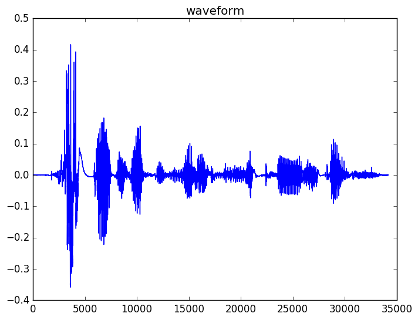
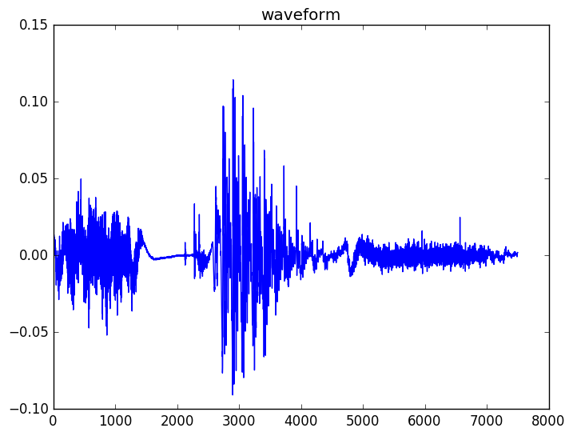
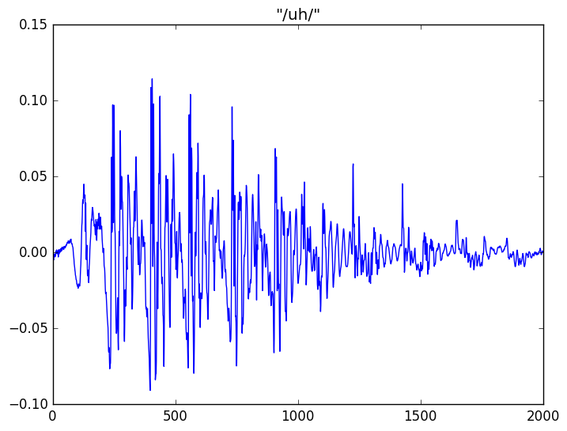
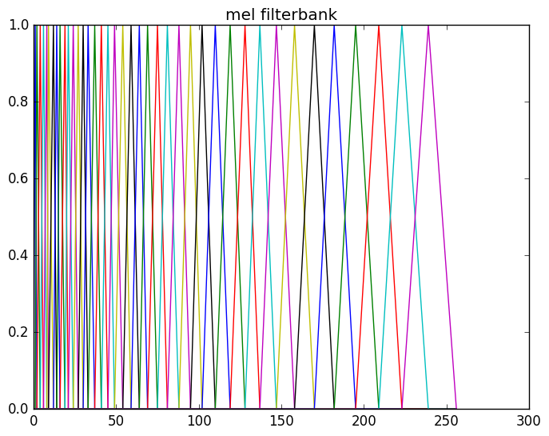
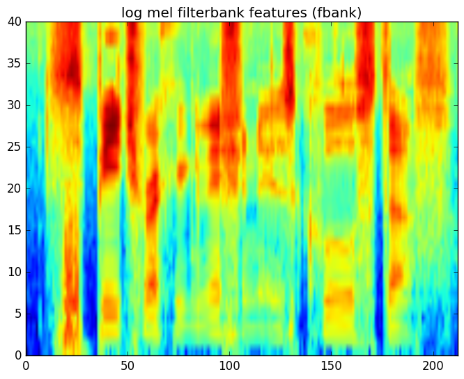
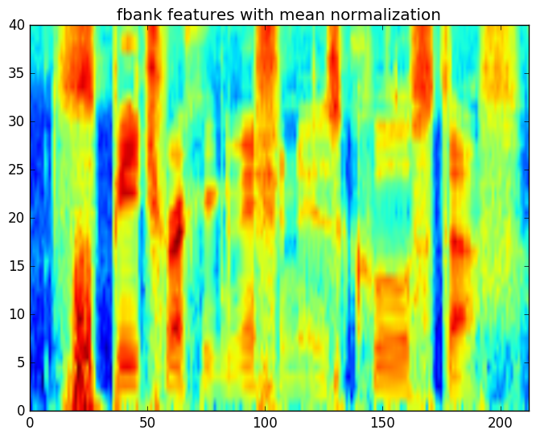
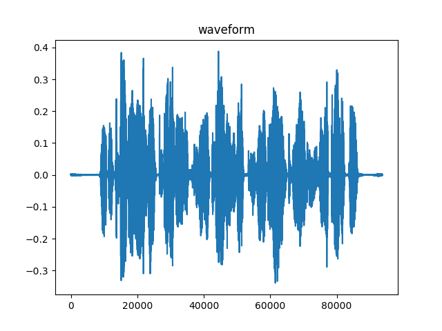
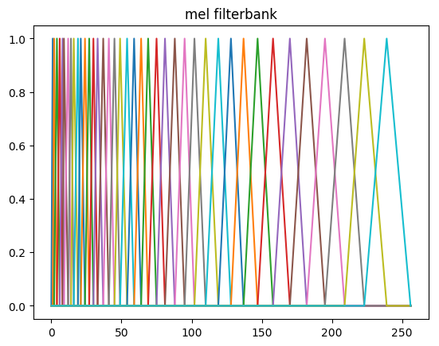
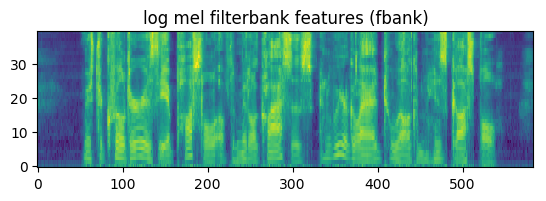

# Speech Signal Processing

## Table of Contents
- [Introduction](#introduction)
- [Feature Extraction](#feature-extraction)
  - [Short-time Fourier Analysis](#short-time-fourier-analysis)
- [Mel filtering](#mel-filtering)
- [Logarithmic compression](#logarithmic-compression)
  - [Other considerations](#other-considerations)
- [Feature Normalization](#feature-normalization)
- [Summary](#summary)
- [Quiz](#quiz)
- [Lab](#lab)


## Introduction
Speech sound waves propagate through the air and are captured by a microphone which converts the pressure wave into electrical activity which can be captured. The electrical activity is sampled to create a sequence of waveform samples that describe the signal. Music signals are typically sampled at 44,100 Hz (or 44,100 samples per second). Due to the Nyquist theorem, this means that audio with frequencies of up to 22,050 Hz can be faithfully captured by sampling. Speech signals have less high frequency (only up to 8000 Hz) information so a sampling rate of 16,000 Hz is typically used. Speech over conventional telephone lines and most mobile phones is band-limited to about 3400 Hz, so a sampling rate of 8000 Hz is typically used for telephone speech.

A typical waveform is plotted here, for the partial sentence "speech recognition is cool stuff".



Recall from module 1, where the concepts of voiced and unvoiced phonemes were discussed. If we focus on the waveform for the last word "stuff" we can see that the waveform has 3 distinct parts, the initial unvoiced sound 'st', the middle voiced vowel sound 'uh', and the final unvoiced 'f'. You can see that the unvoiced parts look noise-like and random which the voiced portion is periodic due to the vibration of the vocal chords.



If we zoom further into the voiced vowel segment, you can see the periodic nature more clearly. The periodic nature arises from the vibration of the vocal chords.



From observing these waveforms, it is apparent that two factors contribute to the characteristics of the waveform, 1) the excitation from the vocal chords that drives the air through the vocal tract and out the mouth and 2) the shape of the vocal tract itself when making a particular sound.

For example, we can see that both the 'st' and 'f' sounds are noise-like due to the unvoiced excitation but have different shapes because they are different sounds. The 'uh' sound is more periodic due to the voiced excitation and with its own shape due to the vocal tract. So, from the same speaker, a different vowel sound would have a similar periodicity but different overall shape because the same vocal chords are generating the excitation, but the shape of the vocal tract is different when producing a different sound.

This speech production process is most commonly modeled in signal processing using a source-filter model. The source is the excitation signal generated by the vocal chords that passes through the vocal tract, modeled as a time-varying linear filter. The source-filter model has many applications in speech recognition, synthesis, analysis and coding, and there are many ways of estimating the parameters of the source signal and the filter, such as the well-known linear predictive coding (LPC) approach.

For speech recognition, the phoneme classification is largely dependent on the vocal tract shape and, therefore, the filter portion of the source-filter model. The excitation or source signal is largely ignored or discarded. Thus, feature extraction process for speech recognition is largely designed for capturing the time-varying filter shapes over the course of an utterance.

## Feature extraction

### Short-time Fourier Analysis
One thing that is apparent from observing these waveforms is that speech is a non-stationary signal. That means its statistical properties change over time. Therefore, in order to properly analyze a speech signal, we need to examine the signal in chunks (also called windows or frames) that are small enough that the speech can be assumed to be stationary within those windows. Thus, we perform the analysis on a series of short, overlapping frames of audio. In speech recognition, we typically use windows of length 0.025 sec (25 ms) with an overlap of 0.01 (10 ms). This corresponds to a frame rate of 100 frames per second.

Because we are extracting a chunk from a longer continuous signal, it is important to take care of edge effects by applying a window to the frame of data. Typically, a Hamming window is used, although other windows may also be used.

If we let m be in the frame index, n is the sample index, and L is the frame size in samples and N is the frameshift in samples, each frame of audio is exacted from the original signal as

$$x_m[n] = w[n] x[m N+n], n=0, 1, \ldots, L-1$$

where $w[n]$ is the window function.

We then transform each frame of data into the frequency-domain using a discrete Fourier transform.

$$X_m[k]=\sum_{n=0}^{N-1}x_m[n]e^{-j 2 \pi k n N}$$

Note that all modern software packages have routines for efficiently computing the Fast Fourier Transform (FFT), which is an efficient way of computing the discrete Fourier transform.

The Fourier representation $X_M[k]$ is a complex number that represents both the spectral magnitude (absolute amplitude) and phase of each frame and frequency. For feature extraction purposes, we do not use the phase information, so we only consider the magnitude $\vert X_m[k] \vert$.

A spectrogram shows a 2D plot log magnitude (or log power) of the result of a short-time Fourier analysis of a speech signal. The horizontal axis shows the frame index (in 10 ms units), and the vertical axis shows the frequency axis from 0 Hz up to the Nyquist frequency with one-half of the sampling rate. For example, the spectrogram of the original waveform "speech recognition is cool stuff" is shown here. In the spectrogram, high-energy regions are shown in orange and red.

## Mel filtering

From the spectrogram, you can see high energy regions at the high frequencies (upper portion of the figure), which correspond roughly to unvoiced consonants, and high energy regions at the lower frequencies, which correspond roughly to voiced vowels. You'll also notice the horizontal lines in the voiced regions, which signify the harmonic structure of voice speech.

To remove variability in the spectrogram caused by the harmonic structure in the voiced regions and the random noise in the unvoiced regions, we perform a spectral smoothing operation on the magnitude spectrum. We apply a filterbank which is motivated by the processing done by the auditory system. This filterbank applies an approximately logarithmic scale to the frequency axis. That is, the filters become wider and farther apart as frequency increases. The most common filterbank used for feature extraction is known as the mel filterbank. A mel filterbank of $40$ filters is shown here. Each filter will average the power spectrogram across a different frequency range. 



Observe that the filters are narrow and closely spaced on the left side of the figure and wider and farther apart on the right side of the figure.

It is typical to represent the mel filterbank as a matrix, where each row corresponds to one filter in the filterbank. Thus, P-dimensional mel filterbank coefficients can be computed from the magnitude spectrum as

$$X_{\tt{mel}}[p] = \sum_k M[p,k] \left|X_m[k]\right|,      p = 0, 1, \ldots, P-1
$$

A mel filterbank of length $40$ is typical, though state-of-the-art systems have been built with fewer or more. Fewer results in more smoothing, and more results in less smoothing. 


## Logarithmic compression
The last step of the feature extraction process is to apply a logarithm operation. This helps compress the dynamic range of the signals and also closely models a nonlinear compression operation that occurs in the auditory system. We refer to the output of this logarithm operation as "filterbank" coefficients.

The spectrogram-like view of the filterbank coefficients for the original waveform is shown here for a 40-dimensional filterbank. Compared to the original spectrogram, the filterbank coefficients are a much smoother version along the vertical (frequency) axis of the spectrogram, where both the high-frequency noise variability and pitch/harmonic structure have been removed. 



### Other considerations

There are other pre-processing steps that can be applied prior to feature extraction. These include

**Dithering**: adding a very small amount of noise to the signal to prevent mathematical issues during feature computation (in particular, taking the logarithm of 0)

**DC-removal**: removing any constant offset from the waveform

**Pre-emphasis**: applying a high pass filter to the signal prior to feature extraction to counteract that fact that typically the voiced speech at the lower frequencies has much high energy than the unvoiced speech at high frequencies. Pre-emphasis is performed with a simple linear filter.

$$y[n] = x[n] - \alpha x[n-1]
$$

where a value of $\alpha=0.97$ is commonly used.

## Feature normalization

It is possible that the communication channel will introduce some bias (constant filtering) on the captured speech signal. For example, a microphone may not have a flat frequency response. In addition, variations in signal gain can cause differences in the computed filterbank coefficients even though the underlying signals represent the same speech. These channel effects can be modeled as a convolution in time, which is equivalent to element-wise multiplication in the frequency domain representation of the signal.

Thus, we can model the channel effects as a constant filter,

$$X_{t,{\tt obs}}[k] = H[k] X_t[k]
$$

And the magnitude of the observation as

$$\left|X_{t,{\tt obs}}[k]\right| = \left|H[k]\right|\left|X_t[k]\right|.
$$

If we take the log of both sides and compute the mean of all frames in the utterance, we have

$$
\begin{align*}
\mu_{\tt obs} &=\frac{1}{T}\sum_t \log\left(\left|X_{t,{\tt obs}}[k]\right|\right) \\\\
&=\frac{1}{T}\sum_t \log\left(\left|H[k]\right|\left|X_t[k]\right|\right) \\\\
&=\frac{1}{T}\sum_t \log\left(\left|H[k]\right|\right)+\frac{1}{T}\sum_t \log\left(\left|X_t[k]\right|\right)
\end{align*}
$$

Now, if we assume that the filter is constant over time and the log magnitude of the underlying speech signal has zero mean, this can be simplified to:

$$\mu_{tt obs}=\log\left(\left|H[k]\right|\right)
$$

Thus, if we compute the mean of the log magnitude of the observed utterance and subtract it from every frame in the utterance, we’ll remove any constant channel effects from the signal.

For convenience, we perform this normalization on filterbank features directly after the log operation. Below is a spectrogram of the previous filterbank coefficients after mean normalization.



## Summary

To compute features for speech recognition from a speech signal, we are interested in extracting information about the time-varying spectral information that corresponds to the different underlying shapes of the vocal tract. These are modeled by a filter in the common source-filter model. The steps for computing the features of an utterance can be summarized as

1. Pre-process the signal, including pre-emphasis and dithering  
2. Segment the signal into a series of overlapping frames, typically 25 ms frames with 10 ms frameshift  
3. For each frame,  
    - Apply a Hamming window function to the signal  
    - Compute the Fourier transform using the FFT operation  
    - Compute the magnitude of the spectrum  
    - Apply the mel filterbank  
    - Apply the log operation  
4. If channel compensation is desired, apply mean normalize the frames of filterbank coefficients.  

## Quiz

Test your understanding of speech signal processing and feature extraction. Select your answers and press **Check answers** &mdash; correct options are highlighted and a short explanation appears for each question.

<div class="srq" markdown="0">
<style>
.srq{max-width:780px;margin:1rem 0;color:var(--fgColor-default,var(--color-fg-default,#1f2328));}
.srq *{box-sizing:border-box;}
.srq-q{border:1px solid var(--borderColor-default,var(--color-border-default,#d0d7de));border-radius:var(--borderRadius-medium,6px);padding:.55rem 1rem .8rem;margin:0 0 1.1rem;background:var(--bgColor-default,var(--color-canvas-default,#fff));}
.srq-q legend{font-weight:var(--base-text-weight-semibold,600);padding:0 .4rem;}
.srq-prompt{margin:.2rem 0 .7rem;font-weight:var(--base-text-weight-semibold,600);}
.srq-hint{font-weight:400;color:var(--fgColor-muted,var(--color-fg-muted,#59636e));font-size:.9em;}
.srq label{display:flex;align-items:flex-start;gap:.55rem;padding:.4rem .55rem;border-radius:var(--borderRadius-medium,6px);cursor:pointer;border:1px solid transparent;}
.srq label:hover{background:var(--bgColor-neutral-muted,var(--color-neutral-muted,rgba(175,184,193,.2)));}
.srq label input{margin-top:.25rem;flex:0 0 auto;}
.srq-exp{display:none;margin:.65rem 0 .1rem;padding:.55rem .7rem;border-left:3px solid var(--fgColor-accent,var(--color-accent-fg,#0969da));background:var(--bgColor-accent-muted,var(--color-accent-subtle,#ddf4ff));border-radius:0 var(--borderRadius-medium,6px) var(--borderRadius-medium,6px) 0;font-size:.92em;}
.srq-q.srq-correct{border-color:var(--borderColor-success-emphasis,var(--color-success-emphasis,#1a7f37));}
.srq-q.srq-incorrect{border-color:var(--borderColor-danger-emphasis,var(--color-danger-emphasis,#cf222e));}
.srq-q.srq-correct .srq-exp,.srq-q.srq-incorrect .srq-exp{display:block;}
.srq label.opt-correct{background:var(--bgColor-success-muted,var(--color-success-subtle,#dafbe1));border-color:var(--borderColor-success-emphasis,var(--color-success-emphasis,#1a7f37));font-weight:var(--base-text-weight-semibold,600);}
.srq label.opt-wrong{background:var(--bgColor-danger-muted,var(--color-danger-subtle,#ffebe9));border-color:var(--borderColor-danger-emphasis,var(--color-danger-emphasis,#cf222e));text-decoration:line-through;}
.srq-actions{display:flex;align-items:center;flex-wrap:wrap;gap:.75rem;margin:.3rem 0 .5rem;}
.srq-actions button{cursor:pointer;padding:.5rem 1rem;border-radius:var(--borderRadius-medium,6px);font-weight:var(--base-text-weight-semibold,600);border:1px solid var(--button-default-borderColor-rest,var(--color-btn-border,rgba(31,35,40,.15)));background:var(--button-default-bgColor-rest,var(--color-btn-bg,#f6f8fa));color:var(--fgColor-default,var(--color-fg-default,#1f2328));}
#srq-check{background:var(--button-primary-bgColor-rest,var(--color-btn-primary-bg,#1f883d));color:var(--button-primary-fgColor-rest,#fff);border-color:var(--button-primary-borderColor-rest,var(--color-btn-primary-border,rgba(31,35,40,.15)));}
.srq-score{font-weight:var(--base-text-weight-bold,700);font-size:1.05em;}
.srq-score.pass{color:var(--fgColor-success,var(--color-success-fg,#1a7f37));}
.srq-score.part{color:var(--fgColor-attention,var(--color-attention-fg,#9a6700));}
</style>
<form id="srq-form" onsubmit="return false;">
<fieldset class="srq-q" data-type="single" data-correct="1">
  <legend>Question 1</legend>
  <p class="srq-prompt">Speech signals carry information up to about 8 kHz, so they are typically sampled at: <span class="srq-hint">(Choose one)</span></p>
  <label><input type="radio" name="q1" value="0"> <span>8,000 Hz</span></label>
  <label><input type="radio" name="q1" value="1"> <span>16,000 Hz</span></label>
  <label><input type="radio" name="q1" value="2"> <span>22,050 Hz</span></label>
  <label><input type="radio" name="q1" value="3"> <span>44,100 Hz</span></label>
  <p class="srq-exp">Speech is typically sampled at <strong>16,000 Hz</strong>; telephone speech (band-limited to ~3.4 kHz) uses 8,000 Hz, and music uses 44,100 Hz.</p>
</fieldset>
<fieldset class="srq-q" data-type="single" data-correct="1">
  <legend>Question 2</legend>
  <p class="srq-prompt">By the Nyquist theorem, a 16,000 Hz sampling rate can faithfully capture frequencies up to: <span class="srq-hint">(Choose one)</span></p>
  <label><input type="radio" name="q2" value="0"> <span>4,000 Hz</span></label>
  <label><input type="radio" name="q2" value="1"> <span>8,000 Hz</span></label>
  <label><input type="radio" name="q2" value="2"> <span>16,000 Hz</span></label>
  <label><input type="radio" name="q2" value="3"> <span>32,000 Hz</span></label>
  <p class="srq-exp">Nyquist: the highest faithfully captured frequency is half the sampling rate, i.e. <strong>8,000 Hz</strong>.</p>
</fieldset>
<fieldset class="srq-q" data-type="single" data-correct="0">
  <legend>Question 3</legend>
  <p class="srq-prompt">What are typical short-time analysis settings for speech? <span class="srq-hint">(Choose one)</span></p>
  <label><input type="radio" name="q3" value="0"> <span>A 25 ms window with a 10 ms shift</span></label>
  <label><input type="radio" name="q3" value="1"> <span>A 10 ms window with a 25 ms shift</span></label>
  <label><input type="radio" name="q3" value="2"> <span>A 1 s window with a 100 ms shift</span></label>
  <label><input type="radio" name="q3" value="3"> <span>A 25 ms window with a 25 ms shift</span></label>
  <p class="srq-exp">A <strong>25 ms window with a 10 ms shift</strong> gives 100 frames per second, the usual choice for ASR.</p>
</fieldset>
<fieldset class="srq-q" data-type="single" data-correct="1">
  <legend>Question 4</legend>
  <p class="srq-prompt">Why is a window function such as a Hamming window applied to each frame? <span class="srq-hint">(Choose one)</span></p>
  <label><input type="radio" name="q4" value="0"> <span>To increase the sampling rate</span></label>
  <label><input type="radio" name="q4" value="1"> <span>To reduce edge effects from extracting a chunk of a continuous signal</span></label>
  <label><input type="radio" name="q4" value="2"> <span>To discard the magnitude spectrum</span></label>
  <label><input type="radio" name="q4" value="3"> <span>To add dithering noise</span></label>
  <p class="srq-exp">Because each frame is cut from a longer signal, a window (e.g. Hamming) is applied to <strong>reduce edge effects</strong>.</p>
</fieldset>
<fieldset class="srq-q" data-type="single" data-correct="1">
  <legend>Question 5</legend>
  <p class="srq-prompt">Which part of the Fourier representation is used for feature extraction? <span class="srq-hint">(Choose one)</span></p>
  <label><input type="radio" name="q5" value="0"> <span>The phase only</span></label>
  <label><input type="radio" name="q5" value="1"> <span>The magnitude only</span></label>
  <label><input type="radio" name="q5" value="2"> <span>Both magnitude and phase</span></label>
  <label><input type="radio" name="q5" value="3"> <span>Neither</span></label>
  <p class="srq-exp">Feature extraction uses the <strong>magnitude</strong> spectrum; the phase is discarded.</p>
</fieldset>
<fieldset class="srq-q" data-type="single" data-correct="1">
  <legend>Question 6</legend>
  <p class="srq-prompt">The mel filterbank applies what kind of scale to the frequency axis? <span class="srq-hint">(Choose one)</span></p>
  <label><input type="radio" name="q6" value="0"> <span>A linear scale</span></label>
  <label><input type="radio" name="q6" value="1"> <span>An approximately logarithmic scale (filters wider and farther apart at high frequency)</span></label>
  <label><input type="radio" name="q6" value="2"> <span>An exponential scale</span></label>
  <label><input type="radio" name="q6" value="3"> <span>A random scale</span></label>
  <p class="srq-exp">The mel filterbank warps frequency on an <strong>approximately logarithmic</strong> scale, mimicking the auditory system.</p>
</fieldset>
<fieldset class="srq-q" data-type="single" data-correct="0">
  <legend>Question 7</legend>
  <p class="srq-prompt">What is the final step (&ldquo;logarithmic compression&rdquo;) of the FBANK feature pipeline? <span class="srq-hint">(Choose one)</span></p>
  <label><input type="radio" name="q7" value="0"> <span>Applying a logarithm to the mel filterbank coefficients</span></label>
  <label><input type="radio" name="q7" value="1"> <span>Applying the FFT</span></label>
  <label><input type="radio" name="q7" value="2"> <span>Pre-emphasis of the waveform</span></label>
  <label><input type="radio" name="q7" value="3"> <span>Windowing the frame</span></label>
  <p class="srq-exp">The last step applies a <strong>logarithm</strong> to the mel filterbank energies, producing the log-mel (&ldquo;FBANK&rdquo;) coefficients.</p>
</fieldset>
<fieldset class="srq-q" data-type="single" data-correct="1">
  <legend>Question 8</legend>
  <p class="srq-prompt">Subtracting the per-utterance mean of the log-filterbank features (mean normalization) mainly serves to: <span class="srq-hint">(Choose one)</span></p>
  <label><input type="radio" name="q8" value="0"> <span>Increase the sampling rate</span></label>
  <label><input type="radio" name="q8" value="1"> <span>Remove constant channel effects</span></label>
  <label><input type="radio" name="q8" value="2"> <span>Add pitch information</span></label>
  <label><input type="radio" name="q8" value="3"> <span>Speed up the FFT</span></label>
  <p class="srq-exp">Mean normalization on the log features removes a <strong>constant (convolutional) channel effect</strong>, since a fixed channel becomes an additive constant after the log.</p>
</fieldset>
<fieldset class="srq-q" data-type="single" data-correct="0">
  <legend>Question 9</legend>
  <p class="srq-prompt">Dithering (adding a very small amount of noise) is used to: <span class="srq-hint">(Choose one)</span></p>
  <label><input type="radio" name="q9" value="0"> <span>Prevent mathematical issues such as taking the logarithm of zero</span></label>
  <label><input type="radio" name="q9" value="1"> <span>Increase the loudness of the signal</span></label>
  <label><input type="radio" name="q9" value="2"> <span>Remove background noise</span></label>
  <label><input type="radio" name="q9" value="3"> <span>Downsample the signal</span></label>
  <p class="srq-exp">Dithering adds a tiny bit of noise to <strong>avoid taking the log of zero</strong> and similar numerical problems.</p>
</fieldset>
<fieldset class="srq-q" data-type="single" data-correct="1">
  <legend>Question 10</legend>
  <p class="srq-prompt">In the lab, an audio file is converted into a sequence of what kind of features? <span class="srq-hint">(Choose one)</span></p>
  <label><input type="radio" name="q10" value="0"> <span>MFCC cepstral coefficients</span></label>
  <label><input type="radio" name="q10" value="1"> <span>Log mel filterbank (&ldquo;FBANK&rdquo;) coefficients</span></label>
  <label><input type="radio" name="q10" value="2"> <span>Raw waveform samples</span></label>
  <label><input type="radio" name="q10" value="3"> <span>Spectrogram phase values</span></label>
  <p class="srq-exp">The pipeline produces <strong>log mel filterbank (FBANK)</strong> coefficients, written to an HTK feature file.</p>
</fieldset>
<div class="srq-actions">
  <button type="button" id="srq-check">Check answers</button>
  <button type="button" id="srq-reset">Reset</button>
  <span id="srq-score" class="srq-score" role="status" aria-live="polite"></span>
</div>
</form>
<script>
(function(){
  var form=document.getElementById('srq-form');
  if(!form)return;
  function want(fs){return (fs.getAttribute('data-correct')||'').split(',').filter(Boolean).map(Number).sort(function(a,b){return a-b;});}
  function got(fs){return Array.prototype.slice.call(fs.querySelectorAll('input:checked')).map(function(i){return Number(i.value);}).sort(function(a,b){return a-b;});}
  function same(a,b){return a.length===b.length&&a.every(function(v,i){return v===b[i];});}
  document.getElementById('srq-check').addEventListener('click',function(){
    var qs=form.querySelectorAll('.srq-q'),correct=0;
    Array.prototype.forEach.call(qs,function(fs){
      var w=want(fs),g=got(fs),ok=same(w,g);
      fs.classList.remove('srq-correct','srq-incorrect');
      fs.classList.add(ok?'srq-correct':'srq-incorrect');
      Array.prototype.forEach.call(fs.querySelectorAll('label'),function(l){
        var inp=l.querySelector('input'),v=Number(inp.value);
        l.classList.remove('opt-correct','opt-wrong');
        if(w.indexOf(v)>-1)l.classList.add('opt-correct');
        else if(inp.checked)l.classList.add('opt-wrong');
      });
      if(ok)correct++;
    });
    var s=document.getElementById('srq-score');
    s.textContent='Score: '+correct+' / '+qs.length;
    s.className='srq-score '+(correct===qs.length?'pass':(correct>0?'part':''));
    form.scrollIntoView({behavior:'smooth',block:'start'});
  });
  document.getElementById('srq-reset').addEventListener('click',function(){
    form.reset();
    Array.prototype.forEach.call(form.querySelectorAll('.srq-q'),function(fs){
      fs.classList.remove('srq-correct','srq-incorrect');
      Array.prototype.forEach.call(fs.querySelectorAll('label'),function(l){l.classList.remove('opt-correct','opt-wrong');});
    });
    document.getElementById('srq-score').textContent='';
  });
})();
</script>
</div>

## Lab

### Feature extraction for speech recognition
#### Required files:
- [M2_Wav2Feat_Single.py](https://github.com/bagustris/speech-recognition-course/blob/master/Experiments/M2_Wav2Feat_Single.py)
- [M2_Wav2Feat_Batch.py](https://github.com/bagustris/speech-recognition-course/blob/master/Experiments/M2_Wav2Feat_Batch.py)
- [speech_sigproc.py](https://github.com/bagustris/speech-recognition-course/blob/master/Experiments/speech_sigproc.py)
- [htk_featio.py](https://github.com/bagustris/speech-recognition-course/blob/master/Experiments/htk_featio.py)

#### Instructions:
In this lab, you will write the core functions necessary to perform feature extraction on audio waveforms. Your program will convert an audio file to a sequence of log mel frequency filterbank ("FBANK") coefficients.

The basic steps in features extraction are

1. Pre-emphasis of the waveform  
2. Dividing the signal into overlapping segments or frames  
3. For each frame of audio:  
    - Windowing the frame  
    - Computing the magnitude spectrum of the frame  
    - Applying the mel filterbank to the spectrum to create mel filterbank coefficients  
    - Applying a logarithm operation to the mel filterbank coefficient  

In the lab, you will be supplied with a Python file called `speech_sigproc.py`. This file contains a partially completed Python class called FrontEnd that performs feature extraction using methods that perform the steps listed above. The methods for dividing the signal into frames (step 2) will be provided for you, as will the code for generating the coefficients of the mel filterbank that is used in step 3c. You are responsible for filling in the code in all the remaining methods.  

There are two top-level Python scripts that call this class. The first is called `M2_Wav2Feat_Single.py`. This function reads a single pre-specified audio file, computes the features, and writes them to a feature file in HTK format.  

In the first part of this lab, you are to complete the missing code in the FrontEnd class and then modify `M2_Wav2Feat_Single.py` to plot the following items:  

1. Waveform  
2. Mel frequency filterbank  
3. Log mel filterbank coefficients  

You can compare the figures to the figures below. Once the code is verified to be working, the feature extraction program should be used to create feature vector files for the training, development, and test sets. This will be done using M2_Wav2Feat_Batch.py. This program takes a command line argument `--set` (or `-s`) which takes as an argument either `train` , `dev` , or `test`. For example  

```bash
$ python M2_Wav2Feat_Batch.py --set train
```

This program will use the code you write in the FrontEnd class to compute feature extraction for all the files in the LibriSpeech corpus. You need to call this program 3 times, once each for train, dev, and test sets.

When the training set features are computed (`--set train`) the code will also generate the global mean and precision (inverse standard deviation) of the features in the training set. These quantities will be stored in two ASCII files in the `am` directory during acoustic model training in the next module.

Here are the outputs you should get from plotting:

 





[Next](../M3_Acoustic_Modeling/)
