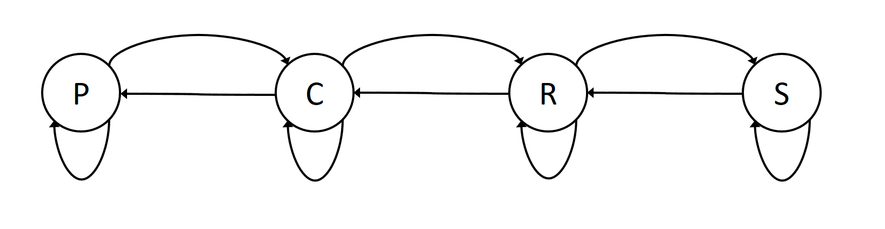
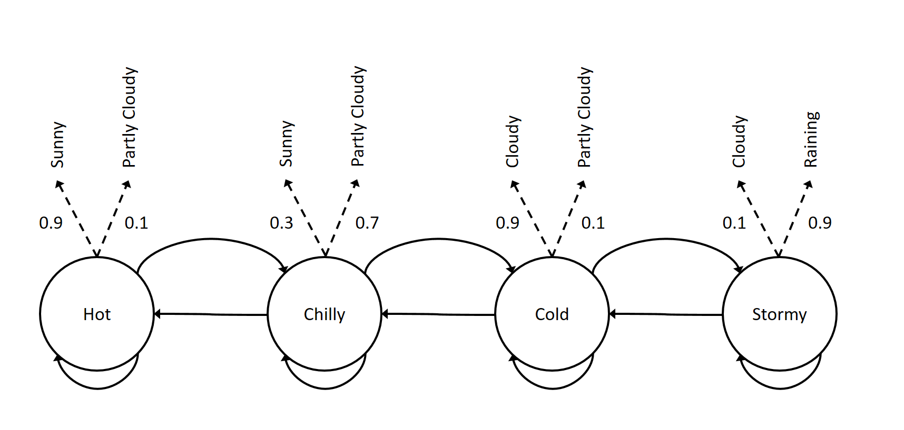
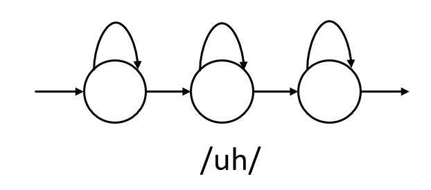
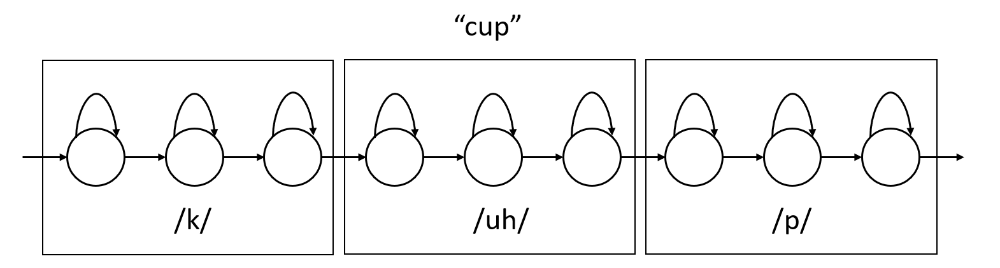
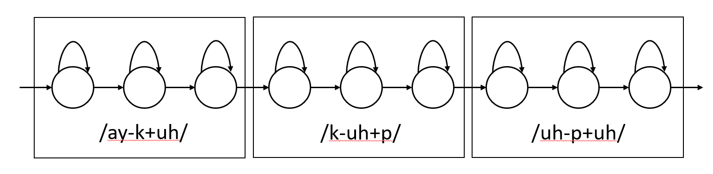
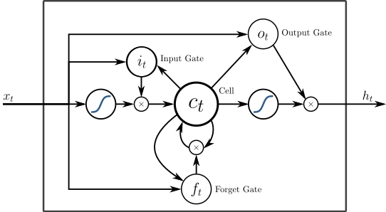
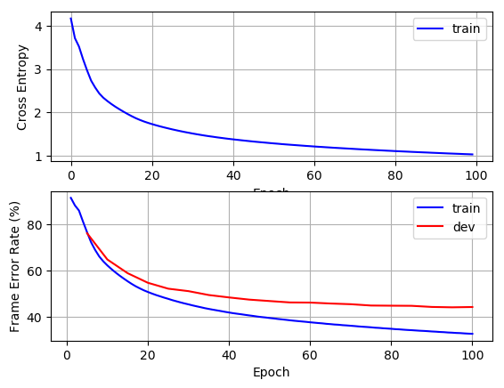

# M3: Acoustic Modeling

[Previous](../M2_Speech_Signal_Processing/)

## Table of Contents
- [Introduction](#introduction)
- [Markov Chains](#markov-chains)
  - [Overview](#overview)
  - [Hidden Markov Models](#hidden-markov-models) 
- [Problem With Hidden Markov Models](#problem-with-hidden-markov-models)
  - [The Evaluation Problem](#the-evaluation-problem)
  - [The Decoding Problem](#the-decoding-problem)
  - [The Training Problem](#the-training-problem)
- [Hidden Markov Models for Speech Recognition](#hidden-markov-models-for-speech-recognition)
  - [Choice of subword units](#choice-of-subword-units)
- [Deep Neural Network Acoustic Models](#deep-neural-network-acoustic-models)
  - [Generating Frame-based Senone Labels](#generating-frame-based-senone-labels)
- [Training Deep Neural Network](#training-deep-neural-network)
  -  [Training Feedforward Deep Neural Networks](#training-feedforward-deep-neural-networks)
  - [Training Recurrent Neural Networks](#training-recurrent-neural-networks)
  - [Long Short-Term Memory Networks](#long-short-term-memory-networks)
- [Using a Sequence-based Objective Function](#using-a-sequence-based-objective-function)
  - [Decoding with Neural Network Acoustic Models](#decoding-with-neural-network-acoustic-models)
- [Quiz](#quiz)
- [Lab](#lab)

## Introduction
In this module, we’ll talk about the acoustic model used in modern speech recognizers. In most systems today, the acoustic model is a hybrid model with uses deep neural networks to create frame-level predictions and then a hidden Markov model to transform these into a sequential prediction. A hidden Markov model (HMM) is a very well-known method for characterizing a discrete-time (sampled) sequence of events. The basic ideas of HMMs are decades old and have been applied to many fields.

## Markov Chains  
### Overview  
Before studying HMMs, it will be useful to briefly review Markov chains. Markov chains are a method for modeling random processes. In a Markov chains, discrete events are modeled with a number of states. The movement among states is governed by a random process.

Let's consider an example. In a weather prediction application, the states could be "Sunny", "Partly Cloudy", "Cloudy", and "Raining". If we wanted to consider the probability of a particular 5 day forecast, e.g. $P(p,p,c,r,s)$, we would employ the chain rule of probability to break up this joint probability into a series of conditional probabilities.

$$p(X_1,X_2,X_3,X_4,X_5)=p(X_5|X_4,X_3,X_2,X_1)p(X_4|X_3,X_2,X_1)p(X_3|X_2,X_1)p(X_2|X_1)p(X_1) 
$$

This expression can be greatly simplified if we consider the first-order Markov assumption, which states that

$$p(X_i|X_1,\ldots,X_{i-1})=p(X_i|X_{i-1})
$$

Under this assumption, the joint probability of a 5-day forecast can be written as

$$ 
\begin{split}
p(X_1,X_2,X_3,X_4,X_5) &= p(X_5|X_4)p(X_4|X_3)p(X_3|X_2)p(X_2|X_1)p(X_1) \\

&=p(X_1)\prod_{i=2}^5p(X_i|X_{i-1})
\end{split}
$$

Thus, the key elements of a Markov chain are the state identities (weather forecast in this case) and the transition probabilities p(X_i \vert X_{i−1}) that express the probability of moving from one state to another (including back to the same state).

For example, a complete (though likely inaccurate) Markov chain for weather prediction can be depicted as



Note that in addition to the conditional probabilities

$$p(X_i|X_{i-1})
$$

in the equation above, there was also a probability associated with the first element of the sequence,

$$p(X_1).
$$

So, in addition to the state inventory and the conditional transition probabilities, we also need a set of prior probabilities that indicate the probability of starting the chain in each of the states. Let us assume our prior probabilities are as follows:

$$p(p)=\pi_p, p(c)=\pi_c, p(r)=\pi_r, p(s)=\pi_s
$$

Now, let us return to the example. We can now compute the probability of $ P(p,p,c,r,s) $ quite simply as

$$\begin{split}
p(p,p,c,r,s) &= p(s|r,c,p,p) p(r|c,p,p) p(c|p,p) p(p|p) p(p) \\
&= p(s|r) p(r|c) p(c|p) p(p|p) p(p)
\end{split}
$$

### Hidden Markov Models

Hidden Markov models (HMMs) are a generalization of Markov chains. In a Markov chain, the state is directly visible to the observer, and therefore the state transition probabilities are the only parameters. In contrast, in an HMM, the state is not directly visible, but the output (in the form of data) is visible. Each state has a probability distribution over the possible output tokens. Therefore, the parameters of an HMM are the initial state distribution, the state transition probabilities, and the output token probabilities for each state.

The Markov chains previously described are also known as observable Markov models. That is because once you land in a state, it is known what the outcome will be, e.g. it will rain. A hidden Markov model is different in that each state is defined not by a deterministic event or observation but by a probability distribution over events or observations. This makes the model doubly stochastic. The transitions between states are probabilistic and so are the observations in the states themselves. We could convert the Markov chain on weather to a hidden Markov model by replacing the states with distributions. Specifically, each state could have a different probability of seeing various weather conditions, such as sun, partly cloudy, cloudy, or rainy.



Thus, a HMM is characterized by a set of N states along with

- A transition matrix that defines probabilities of transitioning among states $A$ with elements $a_{ij}$
- A probability distribution for each state $B= \\{ b_i(x) \\} , \\{ i= 1,2,\ldots, N \\}$
- A prior probability distribution over states $\pi= \lbrace \pi_1, \pi_2, \ldots, \pi_N \rbrace $

Thus, we can summarize the parameters of an HMM compactly as $\Phi = \left \lbrace A, B, \pi\right \rbrace $

There are three fundamental problems for hidden Markov models, each with well-known solutions. We will only briefly describe the problems and their solutions next. There are many good resources online and in the literature for additional details. 

## Problem With Hidden Markov Models
### The Evaluation Problem

Given a model with parameters $\Phi$ and a sequence of observations $X = \left \lbrace x_1, x_2, \ldots, x_T\right \rbrace$, how do we compute the probability of the observation sequence, $P(X \vert \Phi)$? This is known as the evaluation problem. The solution is to use the forward algorithm. 

This evaluation problem can be solved by summing up the probability over all possible values of the hidden state sequence. Implemented naively this can be quite expensive as there are an exponential number of states sequences ($O(N^T)$, where $N$ is the number of states and $T$ the number of time steps).

The forward algorithm is a far more efficient dynamic-programming solution. As its name implies, it processes the sequence in a single pass. It stores up to N values at each time step, and reduces the computational complexity to $O(N^2T)$.

### The Decoding Problem
Given a model $\Phi$ and a sequence of observations $X = \left\lbrace x_1, x_2, \ldots, x_T\right\rbrace$, how do we find the most likely sequence of hidden states $Q = \left\lbrace q_1, q_2, \ldots, q_T\right\rbrace$ that produced the observations? 

This is known as the decoding problem. The solution is to use the Viterbi algorithm. The application of this algorithm to the special case of large vocabulary speech recognition is discussed in Module 5, and an example of how it can be integrated into the training criterion is discussed in Module 6.  

### The Training Problem

Given a model and an observation sequence (or a set of observation sequences) how can we adjust the model parameters $\Phi$ to maximize the probability of the observation sequence?

This problem can be efficiently solved using the Baum-Welch algorithm, which includes the Forward-Backward algorithm.

A byproduct of the forward algorithm mentioned earlier in this lesson is that it computes the probability of being in a state i at time t given all observations up to and including time t. The backward algorithm has a similar structure, but computes the probability of being in state i at time t given all future observations starting at t+1. These two artifacts are combined in the forward-backward algorithm to produce the posterior probability of being in state i at time t given all of the observations.

Once we know the posterior probability for each state at each time, the Baum-Welch algorithm acts as if these were direct observations of the hidden state sequence, and updates the model parameters to improve the objective function. An example of how this applies to acoustic modeling is covered in more depth in Module 6.


## Hidden Markov Models for Speech Recognition  
In speech recognition, hidden Markov models are used to model the acoustic observations (feature vectors) at the subword level, such as phonemes.

It is typical for each phoneme to be modeled with 3 states, to separately model the beginning, middle and end of the phoneme. Each state has a self-transition and a transition to the next state.  



Word HMMs can be formed by concatenating their constituent phoneme HMMs. For example, the HMM word "cup" can be formed by concatenating the HMMs for its three phonemes.



Thus, a high-quality pronunciation dictionary which "spells" each word in the system by its phonemes is critically important for successful acoustic modeling.

Historically, each state in the HMM had a probability distribution defined by a Gaussian Mixture Model (GMM) which is defined as

$$ p(x|s)=\sum_m w_m {\mathcal N}(x;\mu_m, \Sigma_m) $$

where ${\mathcal N}(x;\mu_m,\Sigma_m)$ is a Gaussian distribution and $w_m$ is a mixture weight, with $\sum_m w_m=1$. Thus, each state of the model has its own GMM. The Baum-Welch training algorithm estimated all the transition probabilities as well as the means, variances, and mixture weights of all GMMs.

All modern speech recognition systems no longer model the observations using a collection of Gaussian mixture models but rather a single deep neural network that has output labels that represent the state labels of all HMMs states of all phonemes. For example, if there were 40 phonemes and each had a 3-state HMM, the neural network would have $40\times3=120$ output labels.

Such acoustic models are called "hybrid" systems or DNN-HMM systems to reflect the fact that the observation probability estimation formerly done by GMMs is now done by a DNN, but that the rest of the HMM framework, in particular the HMM state topologies and transition probabilities, are still used.

### Choice of subword units

In the previous section, we described how word HMMs can be constructed by chaining the HMMs for the individual phones in a word according to the pronunciation dictionary. These phonemes are referred to as "context-independent" phones, or CI phones for short. It turns out that the realization of a phoneme is, in fact, heavily dependent on the phonemes that can precede and follow it. For example, the /ah/ sound in "bat" is different from the /ah/ sound in "cap."

For this reason, higher accuracy can be achieved using "context-dependent" (CD) phones. Thus, to model "bat," we'd use an HMM representing the context-dependent phone /b-ah+t/ for the middle /ah/ sound, and for the word "cap," we'd use a separate HMM that modeled /k-ah+p/. So, imagine the word "cup" was in the utterance "a cup of coffee". Then, the cup would be modeled by the following context-dependent HMMs.



Because this choice of context-dependent phones models 3 consecutive phones, they are referred to as "triphones". Though not common, some systems model an even longer phonetic context, such as "quinphones" which is a sequence of 5 consecutive phones.

When context-independent phones are used, there are a very manageable number of states: $N$ phones times $P$ states per phone. U. S. English is typically represented using 40 phones, with three states per phone. This results in 120 context-independent states. As we move to context-dependent units, the number of triphones is $N^3$. This leads to a significant increase in the number of states, for example: $40^3 * 3 = 192,000$.

This explosion of the label space leads to two major problems:

1. Far less data is available to train each triphone
2. Some triphones will not be observed in training but may occur in testing

A solution to these problems is in widespread use, which involves pooling data associated with multiple context-dependent states that have similar properties and combining them into a single “tied” or “shared” HMM state. This tied state, known as a senone, is then used to compute the acoustic model scores for all of the original HMM states whose data was pooled to create it.

Grouping a set of context-dependent triphone states into a collection of senones is performed using a *decision-tree clustering* process. A decision tree is constructed for every state of every context-independent phone.

The clustering process is performed as follows:

1. Merge all triphones with a common center phone from a particular state together to form the root node. For example, state 2 of all triphones of the form /*-p+*/

2. Grow the decision tree by asking a series of linguistic binary questions about the left or right context of the triphones. For example, "Is the left context phone a back vowel?" or "Is the right context phone voiced?" At each node, choose the question that results in the largest increase in likelihood of the training data.

3. Continue to grow the tree until the desired number of nodes are obtained or the likelihood increase of a further split is below a threshold.

4. The leaves of this tree define the senones for this context-dependent phone state.

This process solves both problems listed above. First, the data can now be shared among several triphone states, so the parameter estimates are robust. Second, if a triphone is needed at test time that was unseen in training, its corresponding senone can be found by walking the decision tree and answering the splitting questions appropriately.

Almost all modern speech recognition systems that use phone-based units utilize senones as the context-dependent unit. A production-grade large vocabulary recognizer can typically have about 10,000 senones in the model. Note that this is far more than the 120 context-independent states but far less than the 192,000 states in an untied context-dependent system.

## Deep Neural Network Acoustic Models

One of the most significant advances in speech recognition in recent years is the use of deep neural network acoustic models. As mentioned earlier, the hybrid DNN systems replace a collection of GMMs (one for every senone) with a single deep neural network with output labels corresponding to senones.

The most common objective function used for training neural networks for classification tasks is *cross entropy*. For an $M$-way multi-class classification task such as senone classification, the objective function for a single sample can be written as

$$ E = -\sum_{m=1}^M t_m \log(y_m) $$

Where $t_m$ is the label (1 if the data is from class m and 0 otherwise) and $y_m$ is the output of the network, which is a softmax layer over the output activations. Thus, for each frame, we need to generate an M-dimensional 1-hot vector that consists of all zeros except for a single 1 corresponding to the true label. This means that we need to assign every frame of every utterance to a senone in order to generate these labels.

### Generating Frame-based Senone Labels

To label all frames of the training data with a corresponding senone label, a process known as forced alignment is used. In this process, we essentially perform HMM decoding but constrain search to be along all paths that will produce the correct reference transcription. Forced alignment then generates the single most-likely path, and thus, the senone label for every frame in the utterance.

The forced alignment process needs a speech recognition system to start from. This can be an initial GMM-based system or if the senone set is the same, a previously trained neural network-based system.

The output of forced alignment is typically a file that lists for each utterance the start frame and end frame of a segment and the corresponding senone label. This format can be different depending on the toolkit being used. HTK is a well-known speech recognition toolkit. In HTK, the output from forced alignment is called an MLF file. Here is a snippet from an MLF file produced by forced alignment. The columns of the MLF can be interpreted as

1. Start time (in 100ns time units)
2. End time (in 100ns time units)
3. Senone ID
4. Acoustic model score for that senone segment
5. Context-dependent triphone HMM model (appears at start of phone boundary)
6. Acoustic model score for the triphone HMM model
7. Word in the transcription (appears at start of word boundary)


From this, or a similar output, we can easily generate the labels required for training a deep neural network acoustic model.  

## Training Deep Neural Network
### Training Feedforward Deep Neural Networks

The simplest and most common neural network used for acoustic modeling is the conventional fully connected feed-forward neural network. Information on feedforward DNNs is readily found online so we will focus here on the key aspects of DNN-based acoustic models.

Although we are training a DNN to predict the label for each frame of input, it is very beneficial for classification to provide a context window of frames to the network as input. Specifically, for the frame at time t, the input to the network is a symmetric window of the N frames before and N frames after. Thus, if x_t is the feature vector at time t, the input to the network is

$$X_t = [ x_{t-N},  x_{t-N+1},  \ldots,  x_t,  \ldots,  x_{t+N-1},  x_{t+N} ]
$$

Typical values of N are between 5 and 11, depending on the amount of training data. Larger context windows provide more information but require a larger matrix of parameters in the input layer of the model which can be hard to train without ample data.

It is often advisable to augment the feature vectors with their temporal derivatives, also known as delta features. These features can be computed from simple differences or more complicated regression formulae. For example,

$$ \Delta x_t = x_{t+2} - x_{t-2} $$

$$ \Delta^2 x_t = \Delta x_{t+2} - \Delta x_{t-2} $$

In this case the input to the network for each frame is a context window of stacked features which consist of the original feature vectors, the delta and the delta-delta features

$$ x_t, \Delta x_t, \Delta^2 x_t. $$

This input is then processed through a number of fully connected hidden layers and then finally by a softmax layer over senone labels to make the prediction. This network can then be trained by backpropagation in the usual manner.

 

### Training Recurrent Neural Networks

Recurrent neural networks (RNNs) are a type of neural network that is particularly well-suited to sequence modeling tasks such as speech recognition. RNNs are designed to process sequences of data, such as speech signals, by maintaining an internal state that is updated at each time step. This allows RNNs to capture dependencies between elements in the sequence and to model long-term dependencies.

Unlike feedforward DNNs, recurrent networks process data as a sequence and have a temporal dependency between the weights. There are several standard forms of recurrent networks. A conventional RNN has a hidden layer output that can be expressed as

$$ h_t^i = f(W^i h_t^{i-1} + U^i h_{t-1}^i + c^i) $$

where $f(\cdot)$ is a nonlinearity such as a sigmoid or relu function, i is the layer of the network, $t$ is the frame or time index, and the input $x$ is equivalent to the output of the zeroth layer, $h_t^0=x_t$.

In contrast to a feedforward layer, a recurrent layer's output has a dependence on both the current input and the output from the previous time step. If you are familiar with filtering operations in signal processing, an RNN layer can be considered a nonlinear infinite impulse response (IIR) filter.

In offline applications, where latency is not a concern, it is possible to perform the recurrence in both the forward and backward directions. These networks are known as bidirectional neural networks. In this case, each layer has a set of parameters to process the sequence forward in time and a separate set of parameters to process the sequence in reverse. These two outputs can then be concatenated to input to the next layer. This can be expressed mathematically as

$$\begin{split}

\overrightarrow{h_t^i} &= f\left(W_f^i h_t^{i-1} + U_f^i h_{t-1}^i + c_f^i\right)  \\

\overleftarrow{h_t^i} &= f\left(W_b^i h_t^{i-1} + U_b^i h_{t+1}^i + c_b^i\right) \\

h_t^i &= \left[\overrightarrow{h_t^i}, \overleftarrow{h_t^i}\right] 
\end{split}
$$

where the subscripts $f$ and $b$ indicate parameters for the forward and backward directions, respectively.

RNNs are appealing for acoustic modeling because they can learn the temporal patterns in the feature vector sequences, which is very important for speech signals. In order to train RNNs, therefore, the sequential nature of the training sequences must be preserved. Thus, rather than frame-based randomization which is typically performed in feedforward networks, we perform utterance-based randomization, where the ordering of the utterances is randomized but the sequential nature of the utterances themselves is preserved.

Because the network itself is learning correlations in time of the data, the use of a wide context window of frames on the input is no longer required. It can be helpful for unidirectional RNNs to provide several frames of future context, but this is typically much smaller than in the feed-forward case. In bidirectional RNNs, there is typically no benefit to provide any context window because when processing any particular frame, the network has already seen the entire utterance either via the forward processing or the backward processing.

Training an RNN can still be performed using the same cross-entropy objective function, with a slightly modified gradient computation. Due to the temporal nature of the model, a variation of back-propagation called back-propagation through time (BPTT) is used. This algorithm arises when you consider that in an RNN, the output at the current time step is dependent on the input at the current time step as well as the inputs at all previous time steps (assuming a unidirectional RNN).

Like standard back propagation, BPTT optimizes the model parameters using gradient descent. The gradient of the objective function with respect to the model parameters is computed via the chain rule. Because of the temporal nature of the model, the chain rule requires the multiplication of many gradient terms (proportional to the number of frames of history). Because there is no restriction on these terms, it is possible for the expression to become close to zero (in which case no learning occurs) or become excessively large, which leads to training instability and divergent behavior. This is referred to as vanishing gradients or exploding gradients, respectively. To combat vanishing gradients, there are two well-known solutions: 1) employ specific recurrent structures that avoid these issues, such as LSTM, which will be discussed in the next section, or 2) truncate the BPTT algorithm to only look back to a fixed length history which limits the total number of terms. To combat exploding gradient, a method called gradient clipping is employed, which sets an upper limit on the size of the absolute value of the gradient for any parameter in the model. Gradients with an absolute value larger than the clipping threshold are set to the clipping threshold.

All standard deep learning toolkits support training the recurrent networks with these features.  

### Long Short-Term Memory Networks

In order to combat the issues with vanishing/exploding gradients and better learn long-term relationships in the training data, a new type of recurrent architecture was proposed. These networks are called Long Short-Term Memory (LSTM). Because of their widespread success in many tasks, LSTMs are now the most commonly used type of recurrent network.

An LSTM uses the concept of a cell, which is like a memory that stores state information. This information can be preserved over time or overwritten by the current information using multiplicative interactions called gates. Gate values close to 0 blocked information while gate values close to 1 pass through information. The input gate decides whether to pass information from the current time step into the cell. The forget gate decides whether to persist or erase the current contents of the cell, and the output gate decides whether to pass the cell information onward in the network. A diagram of the LSTM is shown below.



There are many details of LSTMs that can be found online. For example, this blog post does a good job explaining the operation of LSTMs: [https://colah.github.io/posts/2015-08-Understanding-LSTMs/](https://colah.github.io/posts/2015-08-Understanding-LSTMs/).

Other variants of the LSTM have been proposed, such as the Gated Recurrent Unit (GRU), which is a simplified version of the LSTM. On some tasks, GRUs have shown similar performance to LSTMs with fewer parameters.

## Using a Sequence-based Objective Function

While RNNs are a sequential acoustic model in that they model the sequence of acoustic feature vectors as a time series, the objective function is still frame-independent. However, because speech recognition is inherently a sequence-classification task, it is beneficial to employ a sequence-based objective function. Sequence-based objective functions have been proposed for speech recognition for GMM-HMMs and have since been updated to work with neural-network acoustic models. The key difference between frame-based cross entropy and a sequence-discriminative objective function is that the sequence-based objective function more closely models the decoding process. Specifically, a language model is incorporated in order to determine the most likely competitors that the model needs to learn to correctly classify between. Put more simply, in frame-based cross-entropy, any incorrect class is penalized equally, even if that incorrect class would never be proposed in decoding due to HMM state topology or the language model. With sequence training, the competitors to the correct class are determined by performing a decoding of the training data.

There are several sequence discriminative objective functions. One of the most well-known is maximum mutual information (MMI). The MMI objective function can be written as

$$ F_{MMI}= \sum_u \log \frac {p(X_u|S_u)p(W_u)} {\sum_{W'}p(X_u|S_{W'})p(W')} $$

where $u$ is an index over utterances in the training set, $W_u$ is the reference word sequence for utterance $u$, and $S_u$ is the corresponding state sequence. The denominator is a sum over all possible word sequences. $S_{W'}$ would represent the state sequence corresponding to the alternative word sequence  $W'$. This summation penalizes the model by considering competing hypotheses $W'$ that could explain the observed features $X_u$. This is typically approximated by a word lattice, which is a graph over possible hypothesis encountered in decoding.

Using this objective function adds significant complexity to the training of acoustic models but typically results in improved performance and is a component of most state of the art systems. There are also many variations on this such as Minimum Phone Error (MPE) training, and state-level Minimum Bayes Risk (sMBR) training.  

### Decoding with Neural Network Acoustic Models

The neural network acoustic models compute posterior probabilities $p\left(s \vert x_{t} \right)$ over senone labels ($s$). These state-level posterior probabilities must be converted to state likelihoods $p\left( x_{t} \vert s \right)$ for decoding using an HMM, as will be discussed in Module 5. This can be done by an application of Bayes’ rule:

$$ p\left( x_{t} \middle| s \right) = \frac{p\left( s \middle| x_{t} \right)p\left( x_{t} \right)}{p(s)} \propto \frac{p\left( s \middle| x_{t} \right)}{p(s)} $$

Note that because the prior over the observations $p\left( x_{t} \right)$ is constant over all senones, it contributes a constant factor to all likelihood scores so it can be dropped. Thus, the likelihood $p\left( x_{t} \vert s \right)$ is computed by dividing the network’s posterior probabilities by the senone prior $p(s)$. This senone prior probability $p(s)$ can be easily estimated by counting the occurrences of each senone in the training data.

This likelihood is known as a scaled likelihood, to reflect the fact that it has been computed by scaling the senone posterior by its prior.


## Quiz

Test your understanding of acoustic modeling with HMMs and neural networks. Select your answers and press **Check answers** &mdash; correct options are highlighted and a short explanation appears for each question.

<div class="srq" markdown="0">
<style>
.srq{max-width:780px;margin:1rem 0;color:var(--fgColor-default,var(--color-fg-default,#1f2328));}
.srq *{box-sizing:border-box;}
.srq-q{border:1px solid var(--borderColor-default,var(--color-border-default,#d0d7de));border-radius:var(--borderRadius-medium,6px);padding:.55rem 1rem .8rem;margin:0 0 1.1rem;background:var(--bgColor-default,var(--color-canvas-default,#fff));}
.srq-q legend{font-weight:var(--base-text-weight-semibold,600);padding:0 .4rem;}
.srq-prompt{margin:.2rem 0 .7rem;font-weight:var(--base-text-weight-semibold,600);}
.srq-hint{font-weight:400;color:var(--fgColor-muted,var(--color-fg-muted,#59636e));font-size:.9em;}
.srq label{display:flex;align-items:flex-start;gap:.55rem;padding:.4rem .55rem;border-radius:var(--borderRadius-medium,6px);cursor:pointer;border:1px solid transparent;}
.srq label:hover{background:var(--bgColor-neutral-muted,var(--color-neutral-muted,rgba(175,184,193,.2)));}
.srq label input{margin-top:.25rem;flex:0 0 auto;}
.srq-exp{display:none;margin:.65rem 0 .1rem;padding:.55rem .7rem;border-left:3px solid var(--fgColor-accent,var(--color-accent-fg,#0969da));background:var(--bgColor-accent-muted,var(--color-accent-subtle,#ddf4ff));border-radius:0 var(--borderRadius-medium,6px) var(--borderRadius-medium,6px) 0;font-size:.92em;}
.srq-q.srq-correct{border-color:var(--borderColor-success-emphasis,var(--color-success-emphasis,#1a7f37));}
.srq-q.srq-incorrect{border-color:var(--borderColor-danger-emphasis,var(--color-danger-emphasis,#cf222e));}
.srq-q.srq-correct .srq-exp,.srq-q.srq-incorrect .srq-exp{display:block;}
.srq label.opt-correct{background:var(--bgColor-success-muted,var(--color-success-subtle,#dafbe1));border-color:var(--borderColor-success-emphasis,var(--color-success-emphasis,#1a7f37));font-weight:var(--base-text-weight-semibold,600);}
.srq label.opt-wrong{background:var(--bgColor-danger-muted,var(--color-danger-subtle,#ffebe9));border-color:var(--borderColor-danger-emphasis,var(--color-danger-emphasis,#cf222e));text-decoration:line-through;}
.srq-actions{display:flex;align-items:center;flex-wrap:wrap;gap:.75rem;margin:.3rem 0 .5rem;}
.srq-actions button{cursor:pointer;padding:.5rem 1rem;border-radius:var(--borderRadius-medium,6px);font-weight:var(--base-text-weight-semibold,600);border:1px solid var(--button-default-borderColor-rest,var(--color-btn-border,rgba(31,35,40,.15)));background:var(--button-default-bgColor-rest,var(--color-btn-bg,#f6f8fa));color:var(--fgColor-default,var(--color-fg-default,#1f2328));}
#srq-check{background:var(--button-primary-bgColor-rest,var(--color-btn-primary-bg,#1f883d));color:var(--button-primary-fgColor-rest,#fff);border-color:var(--button-primary-borderColor-rest,var(--color-btn-primary-border,rgba(31,35,40,.15)));}
.srq-score{font-weight:var(--base-text-weight-bold,700);font-size:1.05em;}
.srq-score.pass{color:var(--fgColor-success,var(--color-success-fg,#1a7f37));}
.srq-score.part{color:var(--fgColor-attention,var(--color-attention-fg,#9a6700));}
</style>
<form id="srq-form" onsubmit="return false;">
<fieldset class="srq-q" data-type="single" data-correct="0">
  <legend>Question 1</legend>
  <p class="srq-prompt">In a modern hybrid acoustic model, a DNN makes frame-level predictions and what turns them into a sequential prediction? <span class="srq-hint">(Choose one)</span></p>
  <label><input type="radio" name="q1" value="0"> <span>A hidden Markov model (HMM)</span></label>
  <label><input type="radio" name="q1" value="1"> <span>A language model</span></label>
  <label><input type="radio" name="q1" value="2"> <span>A Fourier transform</span></label>
  <label><input type="radio" name="q1" value="3"> <span>A finite state acceptor</span></label>
  <p class="srq-exp">Hybrid systems pair a <strong>DNN</strong> (frame posteriors) with an <strong>HMM</strong> that models the sequence.</p>
</fieldset>
<fieldset class="srq-q" data-type="single" data-correct="0">
  <legend>Question 2</legend>
  <p class="srq-prompt">The HMM Evaluation problem &mdash; computing P(X|&Phi;) &mdash; is solved efficiently by: <span class="srq-hint">(Choose one)</span></p>
  <label><input type="radio" name="q2" value="0"> <span>The forward algorithm</span></label>
  <label><input type="radio" name="q2" value="1"> <span>The Viterbi algorithm</span></label>
  <label><input type="radio" name="q2" value="2"> <span>The Baum-Welch algorithm</span></label>
  <label><input type="radio" name="q2" value="3"> <span>Gradient descent</span></label>
  <p class="srq-exp">The <strong>forward algorithm</strong> sums over hidden state sequences in O(N&sup2;T) time.</p>
</fieldset>
<fieldset class="srq-q" data-type="single" data-correct="1">
  <legend>Question 3</legend>
  <p class="srq-prompt">The HMM Decoding problem &mdash; the most likely hidden state sequence &mdash; is solved by: <span class="srq-hint">(Choose one)</span></p>
  <label><input type="radio" name="q3" value="0"> <span>The forward algorithm</span></label>
  <label><input type="radio" name="q3" value="1"> <span>The Viterbi algorithm</span></label>
  <label><input type="radio" name="q3" value="2"> <span>The Baum-Welch algorithm</span></label>
  <label><input type="radio" name="q3" value="3"> <span>K-means</span></label>
  <p class="srq-exp">The <strong>Viterbi algorithm</strong> finds the single most likely state sequence.</p>
</fieldset>
<fieldset class="srq-q" data-type="single" data-correct="0">
  <legend>Question 4</legend>
  <p class="srq-prompt">The HMM Training problem &mdash; adjusting parameters to maximize the observation probability &mdash; is solved by: <span class="srq-hint">(Choose one)</span></p>
  <label><input type="radio" name="q4" value="0"> <span>The Baum-Welch (forward-backward) algorithm</span></label>
  <label><input type="radio" name="q4" value="1"> <span>The Viterbi algorithm</span></label>
  <label><input type="radio" name="q4" value="2"> <span>The forward algorithm</span></label>
  <label><input type="radio" name="q4" value="3"> <span>Beam search</span></label>
  <p class="srq-exp"><strong>Baum-Welch</strong> (an EM method using forward-backward) re-estimates the HMM parameters.</p>
</fieldset>
<fieldset class="srq-q" data-type="multi" data-correct="0,1,2">
  <legend>Question 5</legend>
  <p class="srq-prompt">An HMM is characterized by which parameters? <span class="srq-hint">(Choose all that apply)</span></p>
  <label><input type="checkbox" name="q5" value="0"> <span>The state transition probabilities (A)</span></label>
  <label><input type="checkbox" name="q5" value="1"> <span>The per-state output/emission distributions (B)</span></label>
  <label><input type="checkbox" name="q5" value="2"> <span>The initial/prior state distribution (&pi;)</span></label>
  <label><input type="checkbox" name="q5" value="3"> <span>The neural-network learning rate</span></label>
  <p class="srq-exp">An HMM is &Phi; = {A, B, &pi;}: transitions, emission distributions, and initial-state priors.</p>
</fieldset>
<fieldset class="srq-q" data-type="single" data-correct="1">
  <legend>Question 6</legend>
  <p class="srq-prompt">Compared with a Markov chain, in an HMM the state is: <span class="srq-hint">(Choose one)</span></p>
  <label><input type="radio" name="q6" value="0"> <span>Directly observable</span></label>
  <label><input type="radio" name="q6" value="1"> <span>Hidden &mdash; only the emitted data is observed</span></label>
  <label><input type="radio" name="q6" value="2"> <span>Always deterministic</span></label>
  <label><input type="radio" name="q6" value="3"> <span>Identical to the observation</span></label>
  <p class="srq-exp">In an HMM the state is <strong>hidden</strong>; only the outputs (data) are seen, making it doubly stochastic.</p>
</fieldset>
<fieldset class="srq-q" data-type="single" data-correct="0">
  <legend>Question 7</legend>
  <p class="srq-prompt">Frame-level training of the DNN acoustic model most commonly uses which objective function? <span class="srq-hint">(Choose one)</span></p>
  <label><input type="radio" name="q7" value="0"> <span>Cross entropy against the softmax output</span></label>
  <label><input type="radio" name="q7" value="1"> <span>Mean squared error on the waveform</span></label>
  <label><input type="radio" name="q7" value="2"> <span>Perplexity</span></label>
  <label><input type="radio" name="q7" value="3"> <span>Only the CTC loss</span></label>
  <p class="srq-exp">Hybrid DNN acoustic models are typically trained with frame-based <strong>cross entropy</strong> against a one-hot state label.</p>
</fieldset>
<fieldset class="srq-q" data-type="single" data-correct="1">
  <legend>Question 8</legend>
  <p class="srq-prompt">DNN acoustic models often take a window of several adjacent frames as input because: <span class="srq-hint">(Choose one)</span></p>
  <label><input type="radio" name="q8" value="0"> <span>It lowers the sampling rate</span></label>
  <label><input type="radio" name="q8" value="1"> <span>Neighboring frames supply useful acoustic context</span></label>
  <label><input type="radio" name="q8" value="2"> <span>It removes the need for an HMM</span></label>
  <label><input type="radio" name="q8" value="3"> <span>The FFT requires it</span></label>
  <p class="srq-exp">Stacking adjacent frames gives the network <strong>acoustic context</strong>, which improves frame classification.</p>
</fieldset>
<fieldset class="srq-q" data-type="single" data-correct="0">
  <legend>Question 9</legend>
  <p class="srq-prompt">Modeling phones in context (e.g. tied triphone states / senones) is motivated by which phenomenon? <span class="srq-hint">(Choose one)</span></p>
  <label><input type="radio" name="q9" value="0"> <span>Coarticulation &mdash; a phone's realization depends on its neighbors</span></label>
  <label><input type="radio" name="q9" value="1"> <span>The Nyquist theorem</span></label>
  <label><input type="radio" name="q9" value="2"> <span>Beam pruning</span></label>
  <label><input type="radio" name="q9" value="3"> <span>Backoff smoothing</span></label>
  <p class="srq-exp"><strong>Coarticulation</strong> makes a phone's realization depend on surrounding phones, motivating context-dependent (senone) models.</p>
</fieldset>
<fieldset class="srq-q" data-type="single" data-correct="0">
  <legend>Question 10</legend>
  <p class="srq-prompt">To use DNN outputs as HMM emission scores for decoding, the posteriors are converted to scaled likelihoods by: <span class="srq-hint">(Choose one)</span></p>
  <label><input type="radio" name="q10" value="0"> <span>Subtracting the log prior of each state</span></label>
  <label><input type="radio" name="q10" value="1"> <span>Adding the language-model score</span></label>
  <label><input type="radio" name="q10" value="2"> <span>Applying pre-emphasis</span></label>
  <label><input type="radio" name="q10" value="3"> <span>Taking the FFT</span></label>
  <p class="srq-exp">Scaled log-likelihood = log posterior &minus; log prior, i.e. dividing the DNN posterior by the state prior (Bayes' rule).</p>
</fieldset>
<div class="srq-actions">
  <button type="button" id="srq-check">Check answers</button>
  <button type="button" id="srq-reset">Reset</button>
  <span id="srq-score" class="srq-score" role="status" aria-live="polite"></span>
</div>
</form>
<script>
(function(){
  var form=document.getElementById('srq-form');
  if(!form)return;
  function want(fs){return (fs.getAttribute('data-correct')||'').split(',').filter(Boolean).map(Number).sort(function(a,b){return a-b;});}
  function got(fs){return Array.prototype.slice.call(fs.querySelectorAll('input:checked')).map(function(i){return Number(i.value);}).sort(function(a,b){return a-b;});}
  function same(a,b){return a.length===b.length&&a.every(function(v,i){return v===b[i];});}
  document.getElementById('srq-check').addEventListener('click',function(){
    var qs=form.querySelectorAll('.srq-q'),correct=0;
    Array.prototype.forEach.call(qs,function(fs){
      var w=want(fs),g=got(fs),ok=same(w,g);
      fs.classList.remove('srq-correct','srq-incorrect');
      fs.classList.add(ok?'srq-correct':'srq-incorrect');
      Array.prototype.forEach.call(fs.querySelectorAll('label'),function(l){
        var inp=l.querySelector('input'),v=Number(inp.value);
        l.classList.remove('opt-correct','opt-wrong');
        if(w.indexOf(v)>-1)l.classList.add('opt-correct');
        else if(inp.checked)l.classList.add('opt-wrong');
      });
      if(ok)correct++;
    });
    var s=document.getElementById('srq-score');
    s.textContent='Score: '+correct+' / '+qs.length;
    s.className='srq-score '+(correct===qs.length?'pass':(correct>0?'part':''));
    form.scrollIntoView({behavior:'smooth',block:'start'});
  });
  document.getElementById('srq-reset').addEventListener('click',function(){
    form.reset();
    Array.prototype.forEach.call(form.querySelectorAll('.srq-q'),function(fs){
      fs.classList.remove('srq-correct','srq-incorrect');
      Array.prototype.forEach.call(fs.querySelectorAll('label'),function(l){l.classList.remove('opt-correct','opt-wrong');});
    });
    document.getElementById('srq-score').textContent='';
  });
})();
</script>
</div>

## Lab 

### Instructions:
In this lab, we will use the features generated in the previous lab along with the phoneme state alignments provided in the course materials to train two different neural network acoustic models, a DNN and an RNN.

The inputs to the training program are:

- **lists/feat_train.rscp, lists/feat_dev.rscp** - List of training and dev feature files, stored in a format called RSCP. This stands for relative SCP file, where SCP is HTK-shorthand for script file. It is simply a list of files in the two sets. The dev set is used in training to monitor overfitting and perform early stopping. These files should have been generated as part of completing lab 2.
- **am/feat_mean.ascii, am/feat_invstddev.ascii** - The global mean and precision (inverse standard deviation) of the training features, also computed in lab 2
- **am/labels_all.cimlf** - The phoneme-state alignments that have been generated as a result of forced alignment of the data to an initial acoustic model. Generating this file requires the construction of a GMM-HMM acoustic model which is outside the scope of this course, so we are providing it to you. The labels for both the training and dev data are in this file.
- **am/labels.ciphones** - The list of phoneme state symbols which correspond to the output labels of the neural network acoustic model
- **am/labels_ciprior.ascii** - The prior probabilities of the phoneme state symbols, obtained by counting the occurrences of these labels in the training data.

The training, dev, and test RSCP files and the training set global mean and precision files were generated by the lab in Module 2. The remaining files have been provided for you and are in the am directory.

#### Part 1: Training a feedforward DNN
We have provided a python program called M3_Train_AM.py which will train a feed-forward deep network acoustic model using the files described above. The program is currently configured to train a network with the following hyperparameters:

- 4 hidden layers of size 512 hidden units per layer.  
- 120 output units corresponding to the phoneme states  
- Input context window of 23 frames, which means the input to the network for a given frame is the current frame plus 11 frames in the past and 11 frames in the future  
- Minibatch size of 256
- Learning is performed with Momentum SGD with a learning rate of 1e-04 per sample with momentum as a time constant of 2500  
- One epoch is defined as a complete pass of the training data and training will run for 100 epochs

The development set will be evaluated every 5 epochs.
This can be executed by running

```bash
$ python M3_Train_AM.py
```

On a GTX 965M GPU running on a laptop, the network trained at a rate of 63,000 samples/sec or about 20 seconds per epoch. Thus, 100 epochs will run in 2000 seconds or about 30 minutes.

After 100 epochs, the result of training, obtained from the end of the log file, was

```text
Finished Epoch[100 of 100]: [CE_Training] loss = 1.036854 * 1257104, metric = 32.74% * 1257104 17.146s (73317.6 samples/s);
Finished Evaluation [20]: Minibatch[1-11573]: metric = 44.26% * 370331;
```

Thus, the training set has a cross entropy of 1.04 per sample, and a 32.74% frame error rate, while the held-out dev set has a frame error rate of 44.3%

After training is complete, you can visualize the training progress using M3_Plot_Training.py. It takes a training log file as input (the log written by M3_Train_AM.py, which prints one `Finished Epoch ...` line per epoch) and will plot epoch vs. cross-entropy of the training set on one figure and epoch vs. frame error rate of the training and development sets on another figure.

```bash
$ python M3_Plot_Training.py --log <logfile>
```

For this experiment, <logfile> would be `../am/dnn/log`

Here is an example of the figure produced by this script.



As you can see from the figure, overfitting has not yet occurred, as the development set performance is still the best in the final epoch. It is possible that small improvements can be made with additional training iterations.

You can now experiment with this neural network training script. You can modify the various hyperparameters to see if the performance can be further improved. For example, you can vary the

- Number of layers
- Number of hidden units in each layer
- Learning rate
- Minibatch size
- Number of epochs
- Learning algorithm (see the CNTK documentation for details on using other learners, such as Adam or AdaGrad)

#### Part 2: Training a Recurrent Neural Network
In the second part of this lab, you will modify the code to train a Bidirectional LSTM (BLSTM) network, a type of recurrent neural network.

To train an BLSTM, there are several changes in the code that you should be aware of.

In DNN training, all frames (samples) are processed independently, so the frames in the training data are randomized across all utterances. In RNN training, the network is trying to learn temporal patterns in the speech sequence, so the order of the utterances can be randomized but the utterances themselves must be kept intact. Thus, we set `frame_mode=False` in the `MinibatchSource` instantiated by `create_mb_source()`.

Change the network creation to create a BLSTM

In `create_network()`, we've created a function called MyBLSTMLayer as specified below. This function uses the Optimized_RNN Stack functionality in CNTK. A complete description and additional examples can be found in the CNTK documentation. One thing to be aware of is that with a BLSTM, the size of the hidden layer is actually applied to both directions. Thus, setting the number of hidden units to 512 means that both the forward and backward layers consist of 512 cells. The outputs of the forward and backward layer are then concatenated forming an output of 1024 units. This is then projected back to 512 using the weight matrix W.


```python
def MyBLSTMLayer(hidden_size=128, num_layers=2):
    W = C.Parameter((C.InferredDimension, hidden_size),
        init=C.he_normal(1.0), name='rnn_parameters')

    def _func(operand):
        return C.optimized_rnnstack(operand, weights=W, hidden_size=hidden_size, num_layers=num_layers, bidirectional=True, recurrent_op='lstm')
    return _func
```

The code calls MyBLSTMLayer when the model_type is BLSTM. We've reduced the number of hidden layers to 2, since the BLSTM layers have more total parameters than the DNN layers.
For utterance based processing, entire utterance needs to be processed during training. Thus the minibatch size specifies the total number of frames to process but will pack multiple utterances together if possible. Setting the minibatch size to a larger number will allow for efficient processing with multiple utterances in each minibatch size. We have set the minibatch size to 4096.
To train the BLSTM model, you can execute the following command.

```bash
$ python M3_Train_AM.py --type BLSTM
```

Because of the sequential nature of the BLSTM processing, they are inherently less parallelizable, and thus, train much slower than DNNs. On a GTX 965M GPU running on a laptop, the network trained at a rate of 440 seconds per epoch, or 20 times slower than the DNN. Thus, we will only train for 10 epochs to keep processing time reasonable.

Here too, you can use M3_Plot_Training.py to inspect the learning schedule in training. And again, if you are interested, you can vary the hyperparameters to try to find a better solution.


[Next](../M4_Language_Modeling/)