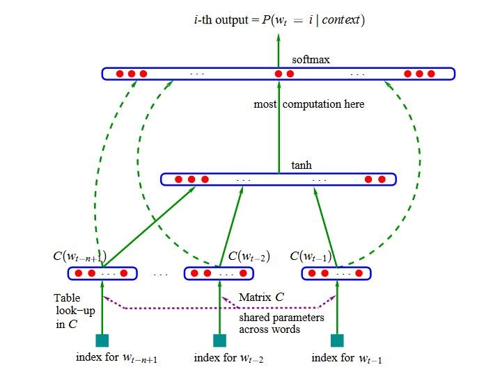
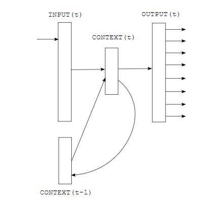

# Language Modeling

## Table of Contents
- [Introduction](#introduction)
- [Vocabulary](#vocabulary)
- [Markov factorization and N-grams](#markov-factorization-and-n-grams)
- [N-gram probability estimation](#n-gram-probability-estimation)
- [N-gram smoothing and discounting](#n-gram-smoothing-and-discounting)
- [Back-off in N-gram models](#back-off-in-n-gram-models)
- [Likelihood, Entropy, and Perplexity](#likelihood-entropy-and-perplexity)
- [N-gram Pruning](#n-gram-pruning)
- [Interpolating Probabilities](#interpolating-probabilities)
- [Merging Models](#merging-models)
- [Class-based Language Models](#class-based-language-models)
- [Neural Network Language Models](#neural-network-language-models)
- [Lab](#lab)

## Introduction

This module covers the basics of language modeling – the component of a speech recognition that estimates the prior probabilities P(W) of possible spoken utterances. Recall that these prior probabilities are combined with the acoustic model likelihoods P(O | W) in the Fundamental Equation of Speech Recognition to arrive at the overall best hypothesis

$$\hat{W} = \mathrm{arg\,max}_{W} P( O | W) P(W)
$$

Thus, the language model (or LM) embodies the recognizer’s knowledge of what probable word sequences are, even before it has heard any actual speech sounds. Instead of encoding hard rules of syntax and semantics that allow some utterances and disallow others, the LM should assign high probabilities to likely utterances and low probabilities to unlikely ones, without ruling anything out completely (because one never knows what people might actually say). Furthermore, the assignment of probabilities is not done by linguistic or other types of rules. Instead, just as with the acoustic model, we will estimate a parameterized model from data. Thus, we let the statistics of actually observed training data determine what words are likely to be heard in a language, scenario, or application.

A note on terminology: in language modeling we often talk about sentences as the word sequence corresponding to an entire speech utterance, without suggesting that these represent anything like a correct and complete sentence in the conventional grammatical sentences. In fact, a sentence for LM purposes can be anything a speaker would utter in the context of a speech application.  

## Vocabulary  

We need to assign a probability to every possible sentence

$$W = w_1 w_2 \ldots w_n
$$

where n is the number of words, which is unbounded in principle. First, we simplify the problem by limiting the choice of words to a finite set, the vocabulary of the LM. Note the vocabulary of the LM is also the vocabulary of the speech recognizer – we cannot recognize a word that is not considered possible by the LM (i.e., it’s probability would be effectively zero).

Words outside the vocabulary are called out-of-vocabulary words, or OOVs. If we ever encounter an OOV in the input data we will incur (at least) one word recognition error, so it is important to choose the vocabulary so as to minimize the chances of OOVs. An obvious strategy is to pick the words that have the highest prior probability of occurring, as estimated from data. In other words, we choose the most frequently occurring words in a corpus of training data. For example, we can pick the N most frequent words, or all words occurring more than K times in the data, for suitable values of N or K. There is often an optimal vocabulary size that represents a good tradeoff between recognizer speed (a larger vocabulary means more computation in decoding) and accuracy (by reducing OOVs, but adding very rare words will have negligible effect on accuracy, and might even hurt accuracy, due to search errors and greater acoustic confusability within the vocabulary).

## Markov factorization and N-grams  

Even with a finite vocabulary, we still have an infinite set of word sequences, so clearly we cannot parameterize the LM by listing the probability of every possible sentence. Even if we conceptually could do so, it would be impossible to get reliable probability estimates as the majority of possible sentences are very rare (the smaller a probability the more data is needed to estimate it reliably).

We can work around both these problems by using a trick we already discussed in the acoustic modeling module: use the chain rule to factor the sentence probability into a product of conditional word probabilities, and then apply the Markov assumption to limit the number of states, and thereby, parameters.

$$P(W) = P(w_1) \times P(w_2 |w_1) \times P(w_3 | w_1 w_2)
\times \ldots \times P(w_n | w_1 \ldots w_{n-1})
$$

Now let’s assume that the Markov state of the LM (often called the context or history) is limited to just one word. This gives us

$$P(W) = P(w_1) \times P(w_2 |w_1) \times P(w_3 | w_2) \times
\ldots \times P(w_n | w_{n-1})
$$

Note how each word is now predicted by only the immediately preceding one, i.e., we’re using a first-order Markov model. However, in language modeling this terminology is not usually used, and instead we call such a model a bigram model, because it uses only statistics of two adjacent words at a time. Correspondingly, a second-order Markov model would be called a trigram model, and predict each word based on the preceding two, and so forth.

The generalization of this scheme is the N-gram model, i.e., each word is conditioned on the previous N-1 words. The parameters of such a model as associated with N-grams, i.e., strings N words. It turns out that there is good improvement when going from bigrams to trigrams, but little improvement as N is increased further. Therefore, in practice we rarely use LMs beyond 4-grams and 5-grams. In the labs we will use trigrams, and in the remainder of this module we will stick to bigrams for the most part, just to simplify notation. Just keep in mind that the concepts generalize to longer N-grams. 

## Sentence start and end

To let our N-gram model assign probabilities to all possible finite word sequences we are left with one small problem: how will the model predict where to end the sentence? We could devise a separate model component for the sentence length n, but it is far easier to introduce a special end-of-sentence tag `</s>` into the vocabulary that marks the end of a sentence. In other words, the LM generates words left to right, and stops as soon as `</s>` is drawn according to the conditional probability distribution. Importantly, this also ensures that the (infinite) sum of all sentences probabilities is equal to one, as it should be for a probability distribution.

Similarly, we also introduce a start-of-sentence tag `<s>`. It is inserted before the first word $w_1$, and in fact represents the context for the first real word. This is important because we want the first word to be predicted with knowledge that it is occurring first thing in the sentence. Certain words such as “I” and “well” are especially frequent in first position, and using the start-of-sentence tag we can represent this using the bigram probabilities $P(w_1 | \lt s \gt)$.

The complete sentence probability according to the bigram model is now

$$P(W) = P(w_1 | \lt s \gt ) \times P(w_2 |w_1) \times \ldots
\times P(w_n | w_{n-1}) \times P(\lt/s\gt | w_n)
$$

We now turn to the problem of actually estimating these N-gram probabilities.

## N-gram probability estimation  

The conditional probabilities based on N-grams can be naively estimated by their relative frequencies. Let $c(w_1 \dots w_k)$ be the number of occurrences (or count) of the k-gram $w_1 \ldots w_k$. For example, the conditional probability of “bites” following “dog” is the ratio

$$P(bites| dog) = { c(dog\ bites) \over c(dog) }
$$

Exercise for the reader: prove that the conditional probabilities of all bigrams containing the same context part

$$P(bites | dog ) + P(bite | dog) + P(wags | dog) + \cdots
$$

equals one (so it is a probability over the entire vocabulary).

More generally, k-gram probability estimates are

$$P(w_k | w_1 \ldots w_{k-1}) = { c(w_1 \ldots w_k) \over c(w_1
\ldots w_{k-1})}
$$ 

## N-gram smoothing and discounting

Relative frequencies as estimates for probabilities have one severe problem: they give probability zero to any N-gram that is not observed in the training data (the numerator in the equation becomes zero). Training data is finite, and we should not rule out a combination of words simply because our limited language sample did not contain it. (Another reason is that language is not a static system, and speakers come up with new expression and even words all the time, either because they are being creative or because language production is error-prone.)

So we need a principled way to assign nonzero probability estimates to N-grams that we have never seen, a process that is often called language model smoothing (we can think of the unobserved N-grams as "holes" in the model, that have to smoothed over). An entire sub-specialty of LM research has looked at this problem and many methods have been proposed, several of which are implemented by the SRILM tools. Here we will discuss one method in detail, known as Witten-Bell smoothing, chosen for two reasons. First, it is relative simple to explain and implement. Second, unlike some of the more sophisticated methods that make additional assumptions about the training data distribution, this method is a very robust.

The idea behind Witten-Bell smoothing is to treat the advent of a previously unseen word type as an event in itself, to be counted along with the seen words. How many times does an "unseen" word occur in the training data? Once for every unique word type, since the first time we encounter it, it counts as a novel word. For unigram (context-independent) probability estimates this means that

$$\hat{P}(w)={c(w) \over c(.)+V}
$$

where $c(w)$ is the unigram word count, $c(.)$ is the sum of all word counts (the length of the training text), and $V$ is the count of "first seen" events, i.e., the vocabulary size. The extra term in the denominator lowers all probability estimates compared to the old relative frequencies. For this reason LM smoothing is often called discounting, i.e., the N-gram probabilities are lowered relative to their relative frequencies. In aggregate, this then leaves some probability mass for the occurrence of new unseen words. For Witten-Bell, the exactly the amount of the freed-up probability is

$$P(unseenword)={V \over c(.)+V}
$$

This is the unigram case. We generalize this to N-grams of length $k$ by treating the first $k−1$ words as the context for the last word, and counting the number of unique word types that occur in that context.

$$\hat{P}(w_k|w_1…w_k−1) = {c(w_1…w_k) \over c(w_1…w_k−1)+V(w_1…w_{k−1}⋅)}
$$

where $V(w_1…w_{k−1}⋅)$ means the size of the vocabulary observed in the context (i.e., right after) $w_1…w_{k−1}$.  Also, the freed-up probability mass now goes to words that are not previously seen *in that context*. 

## Back-off in N-gram models  

How should we distribute the discounted probability mass for a given context? One possibility is evenly over the entire vocabulary. Say we are looking at the context "white dog", and in fact the only trigram with that context in the training data is "white dog barked", twice. The trigram probability under Witten-Bell becomes

$$\hat{P}(barked|white\ dog) = {c(white\ dog\ barked) \over c(white\ dog)+V(white\ dog⋅)} = {2\over2+1}  = {2\over3}
$$

So we now have probability $1/3$ to share with all the other words that might follow "white dog". Distributing it evenly would ignore the fact that some words are just overall more frequent than others. Therefore, we could distribute $1/3$ in proportion to the unigram probabilities of words. However, this would make "white dog the" much more probable than "white dog barks", since "the" much more common than "barks". A better solution is to use reduced context, in this case just "dog" to allocate the probability mass. This means we can draw all occurrences of "dog" to guess what could come next. This method is called back-off, since we are falling back to a shorter (1-word) version of the context when the following word has not been observed in the full (2-word) context. We can write this as

$${\hat{P}}_{\text{bo}}\left( w_{k} \right|w_{1}\ldots w_{k - 1}) = \ \left\{ \begin{matrix} \hat{P}\left( w_{k} \right|w_{1}\ldots w_{k - 1}),\ \ \ c(w_{1}\ldots w_{k}) > 0 \\ {\hat{P}}_{\text{bo}}\left( w_{k} \right|w_{2}\ldots w_{k - 1})\ \alpha(w_{2}\ldots w_{k - 1}),\ \  c\left( w_{1}\ldots w_{k} \right) = 0 \\ \end{matrix} \right.
$$

$\hat{P}_{bo}$ is the new back-off estimate for all N-grams. If an N-grams has been observed (count > 0, the first branch) it makes direct use of the discounted estimates $\hat{P}$. If the N-grams is unseen in training, looks up the estimate recursively for the shortened context (leaving out $w_1$) and then scales it by a factor α, which is a function of the context, so that the estimates for all w_k again sum to one. ($α$ is the probability of the unseen words in context $w_1…w_{k−1}$, as discussed earlier, divided by the sum of the same unseen-word probabilities according to the back-off distribution $\hat{P}_{bo}(⋅|w_2…w_{k−1}$).

The $\alpha$ parameters are called backoff weights, but they are not free parameters of the model. Rather, once the N-gram probabilities \hat{P} have been determined, the backoff weights are completely determined. Computing them is sometimes called (re-)normalizing the model, since they are chosen just so all the probability distributions sum to unity.

## Likelihood, Entropy, and Perplexity

Given two language models A and B, how can we tell which is better? Intuitively, if model A always gives a higher probabilities than B to the words that are found in a test (or evaluation) set, then A is better, since it "wastes" less probability on the words that did not occur in actuality. The total probability of a test set $w_{1}\ldots w_{n}$
according to the model is

$$P\left( w_{1}\ldots w_{n} \right) = P\left( w_{1}| < s > \right) \times P\left( w_{2} \right|\ w_{1}) \times P\left( w_{3} \right|\ w_{2}) \times \ldots \times P( < /s > \ |\ w_{n})
$$

(where we revert to the case of a bigram model just to keep notation simple). We are now talking about a test set containing multiple sentences, so at sentence boundaries we reset the context to the `<s>` tag. The probabilities get very small very quickly, so it is more practical to carry out this computation with log probabilities:

$$\log{\ P(w_{1}\ldots w_{n})} = \log{P(w_{1}| < s > )} + \log{P\left( w_{2} \right|\ w_{1})} + \ldots + \log{P( < /s > \ |\ w_{n})}
$$

Viewed as a function of the model, this is sometimes called the log likelihood of the model on the test data. Log likelihoods are always negative because the probabilities are less than one. If we flip the sign, and take the average over all the words in the test data

$$- \frac{1}{n}\log{P(w_{1}\ldots w_{n})}
$$

we get a metric called entropy, which is a measure of information rate of the word stream. The entropy gives us the average number of bits required to encode the word stream using a code based on the model probabilities (more probable words are encoded with fewer bits, to minimize the overall bit rate).

Yet another metric for model quality (relative to some test data) is the average reciprocal of the word probability, or perplexity. So, if words on average are assigned probability 1/100 then the perplexity would be 100. In other words, the perplexity is the size of a vocabulary of equally probable words that produces the same uncertainty about what comes next, as the actual model in question (justifying the term "perplexity").

How to compute perplexity: Because probabilities are combined by multiplication, not addition, we must use the geometric average on the product of the word probabilities:

$$\sqrt[n]{\frac{1}{P(w_{1}\ldots w_{n})}} = {P(w_{1}\ldots w_{n})}^{- \frac{1}{n}}
$$

This means that perplexity is just the anti-logarithm (exponential) of the entropy, which means all the above metrics are equivalent and related as follows:

>   HIGH likelihood ↔ LOW entropy ↔ LOW perplexity ↔ GOOD model

>   LOW likelihood ↔ HIGH entropy ↔ HIGH perplexity ↔ BAD model

Remember to evaluate model quality (by likelihood, entropy, or perplexity) on a test set that is independent (not part) of the training data to get an unbiased estimate.

## N-gram Pruning  

An N-gram language model effectively records the N-grams in the training data, since each such N-gram yields a probability estimate that becomes a parameter in the model. This has the disadvantage that model size grows almost linearly with the amount of training data. It would be good to eliminate parameters that are redundant, i.e., where the back-off mechanism gives essentially the same result after removing a higher-order N-gram parameter. In a related task, we may want to shrink a model down to a certain size (for practical reasons) such that the least important parameters are removed to save space.

We can use the notion of entropy (or perplexity) to perform these tasks in a principled way. For each N-gram probability in the model, we can compute the change in entropy (perplexity) this entails, and if the difference is below some threshold eliminates, or prune, the parameter. After pruning probabilities, the model needs to be renormalized (back-off weights recomputed).

To make this algorithm practical, we don't need or want to use a separate test set to estimate entropy. Instead, we can use the entropy of the distribution embodied by the model itself. This leads to a succinct and [efficient pruning criterion](https://arxiv.org/pdf/cs/0006025v1.pdf) that uses only the information contained in the model.

## Interpolating Probabilities

Assume you have we two existing language models already trained, producing probability estimates ${\hat{P}}_{1}$ and ${\hat{P}}_{2}$, respectively. How can we combine these models for a better estimate of N-gram probabilities? If available, we could retrieve the training data for these models, pool it, and train a new model from the combined data. However, this is inconvenient and raises new problems? What to do if one model has vastly more training data than the other? For example, the large model might be trained on newswire text, and the small model on a small data collected for a new application. The large, mismatched corpus would complete swamp the N-gram statistics and the resulting model would be mismatched to the intended application.

A better approach is to combine the existing models at the probability level, by interpolating their estimates. Interpolation means we compute a weighted average of the two underlying probability estimates:

$$\hat{P}\left( w_{k} \right|w_{1}\ldots w_{k - 1}) = \lambda\ {\hat{P}}_{1}\left( w_{k} \right|w_{1}\ldots w_{k - 1}) + (1 - \lambda)\ {\hat{P}}_{2}\left( w_{k} \right|w_{1}\ldots w_{k - 1})
$$

The parameter λ controls the relative influence of the component models. A value close 1 means the first model dominates; a value close to 0 gives most of the weight to the second model. The optimal value of $\lambda$ can be itself estimated using held-out data (i.e., data that is separate from the training data for the component models), by choosing a value that minimizes the perplexity on the held-out data.

Model interpolation is easily generalized to more than two models: a weighted combination of $M$ models using weights $\lambda_{1},\ \lambda_{2},\ldots,\ \lambda_{M}$, such that $\lambda_{1} + \ \lambda_{2}, + \ \ldots + \ \lambda_{M} = 1$. The condition that weights sum to 1 is needed to make sure that the interpolated model is again a properly normalized probability distribution over all word strings.

## Merging Models

Even though model interpolation is often highly effective in lowering overall perplexity without requiring retraining from the original training data, there is one practical problem: we need to keep multiple models around (on disk, in memory), evaluate each, and combine their probabilities on the fly when evaluating the interpolated model on test data.

Fortunately, in the case of backoff N-gram based LMs we can construct a single combined N-gram model that is a very good approximation to the interpolated model defined by the above equation. Such a model can be obtained by the following steps:

    for k=1,...,N:

       for all ngrams w1…wk

            Insert w1…wk into the new model

            Assign probability P^(wk|w1…wk−1 according to equation (\*)

       end

       Compute backoff weights for all ngram contexts of length k−1 in the new model

    end

Note that when we compute the $\hat{P}$ interpolated estimates, one of ${\hat{P}}_{1} and {\hat{P}}_{2}$ (but not both) could be obtained by the back-off mechanism.

## Class-based Language Models
 
In this section we give a high-level understanding of a couple of the more advanced techniques in language modeling that are now widely used in practice. The methods in language modeling are constantly evolving, and research in this area is very active. By [some estimates](https://www.isca-archive.org/interspeech_2017/shen17_interspeech.html), the perplexity of state-of-the-art LMs is still two to three times worse than the predictive powers of humans, so we have a long way to go!

One of the drawbacks of N-gram models is that all words are treated as completely distinct. Consequently, the model needs to see a word sufficiently many times in the training data to learn N-grams it typically appears in. This is not how humans use language. We know that the words 'Tuesday' and 'Wednesday' share many properties, both syntactically and meaning-wise, and seeing N-grams with one word primes us to expect similar ones using the other (seeing 'store open Tuesday' makes us expect 'store open Wednesday' as a likely N-gram). Word similarity should be exploited to improve generalization in the LM.

Class-based language models therefore group (some) words into word classes, and then collect N-gram statistics involving the class labels instead of the words. So if we had defined a class 'WEEKDAY' with members 'Monday', 'Tuesday', …, 'Friday', the N-gram 'store open Tuesday' would be treated as an instance of 'store open WEEKDAY'. The probability of the pure word string according to the LM is now a product of two components: the probability of the string containing the class labels (computed in the usual way, the class labels being part of the N-gram vocabulary), multiplied by the class membership probabilities, such as $P(Tuesday∨WEEKDAY)$. The membership probabilities can be estimated from data (how many times 'Tuesday' occurs in the training corpus relative to all the weekdays), or set to a uniform distribution (e.g., all equal to 15).

There are two basic approaches to come up with good word classes. One involves prior knowledge, typically from an application domain. For example, for building a language model for a travel app, we know that entities such as the names of destinations ('Tahiti', 'Oslo'), airlines and days of the week will need to be covered regardless of training data coverage, even though the training data is unlikely to have usage samples of all the possible instantiations. We can ensure coverage by defining an N-gram model in terms of classes such as 'AIRPORT', 'AIRLINE', 'WEEKDAY', etc. This also means we can set class membership probabilities from domain statistics, such as the popularity of certain travel destinations. It also suggests generalizing the concept of word-class membership to word phrases, such as 'Los Angeles' for AIRPORT. The class N-gram modeling framework can accommodate word phrases, with [some modifications](https://www.microsoft.com/en-us/research/wp-content/uploads/2016/02/Levit_WPELM_Interspeech2014.v3.pdf).

The other way to define word classes is in a purely data-driven way, without human or domain knowledge. We can search the space of all possible word/class mappings and pick one that minimizes the perplexity of the resulting class-based model on the training data (or equivalently, maximizes the likelihood). The details of this search are nontrivial if is to be carried out in reasonable time, but several practical algorithms [have been proposed](http://anthology.aclweb.org/J/J92/J92-4003.pdf).  

## Neural Network Language Models

Neural network-based machine learning methods have taken over in many areas, including in acoustic modeling for speech recognition, as we saw earlier in this course. Similarly, artificial neural networks (ANNs) have also been devised for language modeling, and, given sufficient training data, have been shown to give superior performance compared to N-gram methods.

Much of the success of ANNs in language modeling stems from overcoming two specific limitations of N-gram models. The first limitation is the lack of generalization across words. We saw how word classes tried to address this problem, while introducing a new problem: how to define suitable word classes. The first proposed ANN LM architecture, now known as a feedforward language model, addressed the word generalization problem by including a word embedding layer that maps the discrete word labels upon input to a dense vector space.

As depicted in the figure (taken from the Bengio et al. paper), the input to the network are unary (one-hot) encodings of the N - 1 words forming the N-gram context. The output is a vector of probabilities of predicted following words. (In both input and outputs, we use vectors of the length of the vocabulary size.) The model is thus a drop-in replacement for the old N-gram-based LM. The key is that the input words are reencoded via a shared matrix into new vectors, which are no longer one-hot, i.e., they live into a dense high-dimensional space. This mapping is shared for all context word positions, and, crucially, is trained concurrently with the next-word predictor. The beauty of this approach is that the learned word embeddings can be tuned to represent word similarity for the purposes of word prediction. In other words, context words that affect the next word similarly, will be encoded as nearby points in space, and the network can then exploit this similarity when encountering the words in novel combinations. This is because all network layers perform smooth mappings, i.e., nearby inputs will generate similar outputs. (It has been shown that words like 'Tuesday' and 'Wednesday' do indeed end up with similar embeddings.)

The second limitation of N-grams that was overcome with ANN methods is the truncation of the context, which so far always was limited to the previous N - 1 words. This is a problem because language allows embedded clauses, arbitrarily long lists of adjectives, and other constructs that can put arbitrary distance between related words that would be useful in next-word prediction. Any reasonable value of N would be insufficient to capture all predictive words in a context. The limitation is overcome in recurrent networks, which feed the activations of a hidden layer at time t - 1 as extra inputs to the next processing step at time t, as shown in this figure:

This allows the network to pass information from one word position to the next, repeatedly, without a hard limit on how far back in time information originates that can be used to predict the current next word. There are practical issues with the trainability of such recurrent networks because the mathematical rules governing ANN activations lead to an exponential dilution of information over time. However, these problems can be solved with mechanisms to gate information flow from one time step to the next.

Both feed-forward and recurrent network LMs have also benefited from general improvements in ANN technology, such as deeper stacking of network layers ('deep learning') and better training methods. Another trend in neural LMs is to base the model on characters rather than word units. It is clear that the flexibility that ANNs provide for experimenting with model architectures in terms of high-level information flow, rather than having to worry about the detailed design of encodings and probability distributions, have greatly advanced the field, with more still to come.

## Lab 

## Language Modeling

This lab covers the following topics:
- Defining a top-N vocabulary from training data
- Computing N-gram counts
- Estimating backoff N-grams, understanding the backoff rule
- Computing perplexity, OOV rates
- Perplexity as a function of training data size
- Interpolating two models
- Pruning of an N-gram model, perplexity as a function of model size

### Introduction and setup

In this lab, we will practice the main techniques for building N-gram based language models for our speech recognizer. In subsequent modules, the resulting LM will be used in the speech recognition decoder, together with the acoustic model from the preceding lab.

This lab is carried out in a Linux command shell environment. The get started, make sure you know how to invoke the Linux bash shell, either on a native Linux system, using Cygwin on a Windows system, or in the Windows subsystem for Linux. Bash is the default shell on most systems.

Inside bash, change into the M4_Language_Modeling directory:

    cd M4_Language_Modeling

We will be using pre-built executables from the SRI Language Modeling toolkit (SRILM). Start by adding the SRILM binary directories to your search path. If you are in a Cygwin,

    PATH=$PWD/srilm/bin/cygwin64:$PWD/srilm/bin:$PATH

In Linux or Windows Subsystem for Linux, use

    PATH=$PWD/srilm/bin/i686-m64:$PWD/srilm/bin:$PATH

You can put this command in the .bashrc file in your home directory, so it is run automatically next time you invoke the shell. Also, make sure you have the gawk utility installed on your system. As a check that all is set up, run

    ngram-count -write-vocab –

    compute-oov-rate < /dev/null

which should each output a few lines of text without error messages. It will be helpful to also install the optional wget command.

Since language modeling involves a fair amount of text processing it will be useful to have some familiarity with Linux text utilities such as sort, head, wc, sed, gawk or perl, and others, as well as Linux mechanisms for redirecting command standard input/output, and pipelining several commands. We will show you commands that you can copy into the shell to follow along, using this symbol

    command argument1 argument2 …

but we encourage you try your own solutions to achieve the stated goals of each exercise, and to explore variants.
Preparing the data

We will be using the transcripts of the acoustic development and test data as our dev and test sets for language modeling.

TASK: Locate files in the ‘data’ subdirectory and count the number of lines and words in them.

SOLUTION:

    ls data

    wc -wl data/dev.txt data/test.txt

TASK: View the contents of these files, using your favorite pager, editor, or other tool. What do you notice about the format of these files? How do they differ from text you are used to?

SOLUTION

    head data/*.txt

You will notice that the data is in all-lowercase, without any punctuation. This is because we will model sequences of words only, devoid of textual layout, similar to how one your read or speak them. The spelling has to match the way words are represented in the acoustic model. The process of mapping text to the standard form adopted for modeling purposes is called text normalization (or TN for short), and typically involves stripping punctuation, mapping case, fixing typos, and standardizing spellings of words (like MR. versus MISTER). This step can consume considerable time and often relies on powerful text processing tools like sed or perl.

Because it is so dependent on the source of the data, domain conventions, and tool knowledge, we will not elaborate on it here. Instead, we will download an LM training corpus that has already been normalized,

    wget http://www.openslr.org/resources/11/librispeech-lm-norm.txt.gz

If your system doesn’t have the wget command you can download this file in a browser and move it into the LM lab directory.

TASK: Inspect the file and count lines and word tokens. How does the text normalization of this file differ from our test data?

SOLUTION: The file is compressed in the gzip (.gz) so we must use the gunzip tool

    gunzip -c librispeech-lm-norm.txt.gz | head

    gunzip -c librispeech-lm-norm.txt.gz | wc -wl

The second command can take a while as the file is large. You will notice that this file is text normalized but uses all-uppercase instead of all-lowercase.

Language model training data, and language models themselves, are often quite large but compress well since they contain text. Therefore, we like to keep them in compressed form. The SRILM tools know how to read/write .gz files, and it is easy to combine gzip/gunzip with Linux text processing tools.

OPTIONAL TASK: Download the raw training data at http://www.openslr.org/12/librispeech-lm-corpus.tgz, and compare it to the normalized text. How would you perform TN for this data?

SOLUTION left to the reader!

### Defining a vocabulary

The first step in building a LM is to define the set of words that it should model. We want to cover the largest possible share of the word tokens with the smallest set of words, to keep model size to a minimum. That suggests picking the words that are most frequent based on the training data.

One of the functions of the ngram-count tool is to count word and ngram occurrences in a text file.

    ngram-count -text TEXT -order 1 -write COUNTS -tolower

Will count 1-grams (i.e., words) and write the counts to a file. The final option above maps all text to lowercase, thus dealing with the mismatch we have between our training and test data.

TASK: Extract the list of the 10,000 most frequent word types in the training data. What kinds of words do you expect to be at the top of the list? Check your intuition.

HINT: Check out the Linux sort, head, and cut commands.

SOLUTION:

    ngram-count -text librispeech-lm-norm.txt.gz -order 1 -write librispeech.1grams -tolower

    sort -k 2,2 -n -r librispeech.1grams | head -10000 > librispeech.top10k.1grams

    cut -f 1 librispeech.top10k.1grams | sort > librispeech.top10k.vocab

The intermediate file librispeech.top10k.1grams contains the words and their counts sorted most frequent first. As you might expect, common function words liked “the”, “and”, “of” appear at the top of the list. Near the top we also find two special tags, `<s>` and `</s>`. These are added by ngram-count to mark the start and end, respectively, of each sentence. Their count equals the number of non-empty lines in the training data, since it is assumed that each line contains one sentence (empty lines are ignored).

We now want to find out how well out 10k vocabulary covers the test data. We could again use Linux tools for that, but SRILM contains a handy script compute-oov-rate that takes two arguments: the unigram count file and the list of vocabulary words.

TASK: What is the rate of out-of-vocabulary (OOV) words on the training, dev and test sets?

HINT: Use the same method as before to generate the unigrams for dev and test data.

SOLUTION:

    compute-oov-rate librispeech.top10k.vocab

    ngram-count -text data/dev.txt -order 1 -write dev.1grams

    compute-oov-rate librispeech.top10k.vocab dev.1grams

    ngram-count -text data/test.txt -order 1 -write test.1grams

    compute-oov-rate librispeech.top10k.vocab test.1grams

Usually we expect the OOV rate to be lowest on the training set because we used it to select the words (the vocabulary is biased toward the training set), but in this case the test sets have been chosen to be “cleaner” and have lower OOV rates. (The training data actually contains some languages other than English, though most of those will not make it into the vocabulary.)

Note that compute-oov-rate also reports about “OOV types”. OOV types are the number of unique words that are missing from the vocabulary, regardless of how many times they occur.

The OOV rate of around 5% is quite high – remember that we will never be able to recognize those OOV words since the LM does not include them (they effectively have probability zero). However, we chose the relatively small vocabulary size of 10k to speed up experiments with the decoder later.

OPTIONAL TASK: Repeat the steps above for different vocabulary sizes (5k, 20k, 50k, 100k, 200k). Plot the OOV rate as a function of vocabulary size. What shape do you see?

### Training a model

We are now ready to build a language model from the training data and the chosen vocabulary. This is also done using the ngram-count command. For instructional purpose we will do this in two steps: compute the N-gram statistics (counts), and then estimate the model parameters. (ngram-count can do both in one step, but that’s not helpful to understand what happens under the hood.)

TASK: Generate a file containing counts of all trigrams from the training data. Inspect the resulting file.

HINT: Consult the ngram-count man page and look up the options -order, -text, and -write. Remember the case mismatch issue.

SOLUTION: The first command uses about 10GB of memory and takes 15 minutes on a 2.4GHz Intel Xeon E5 CPU, so be sure to procure a sufficiently equipped machine and some patience.

    ngram-count -text librispeech-lm-norm.txt.gz -tolower -order 3 -write librispeech.3grams.gz

    gunzip -c librispeech.3grams.gz | less

Note that we want to compress the output file since it is large. The -order option in this case is strictly speaking optional since order 3 is the default setting. Note that the output is grouped by common prefixes of N-grams, but that the words themselves are not alphabetically sorted. You can use the -sort option to achieve the latter.

Now we can build the LM itself. (Modify the output file names from previous steps according to your own choices.)

TASK: Estimate a backoff trigram LM from librispeech.3grams.gz, using the Witten-Bell smoothing method.

HINT: Consult the ngram-count man page for options -read, -lm, -vocab, and -wbdiscount .

SOLUTION:

    ngram-count -debug 1 -order 3 -vocab librispeech.top10k.vocab -read librispeech.3grams.gz -wbdiscount -lm librispeech.3bo.gz

We added the -debug 1 option to output a bit of information about the estimation and resulting LM, in particular the number of N-grams output.

We will now try to understand the way LM parameters are stored in the model file. Peruse the file using

    gunzip -c librispeech.3bo.gz | less

or, if you prefer, gunzip the entire file using

    gunzip librispeech.3bo.gz

and open librispeech.3bo in an editor. Note: the editor better be able to handle very large files – the LM file has a size of 1.3 GB.
Model evaluation

Consult the description of the backoff LM file format ngram-format(5), and compare to what you see in our model file, to be used in the next task.

TASK: Given the sentence “a model was born”, what is the conditional probability of “born”?

SOLUTION: The model is a trigram, so the longest N-gram that would yield a probability to predict “born” would be “model was born”. So let’s check the model for that trigram. (One way to locate information in the model file is the zgrep command, which searches a compressed file for text strings. Each search string below starts with a TAB character to avoid spurious matches against other words that contain the string as a suffix. You can use your favorite tools to perform these searches.)

    zgrep " model was born" librispeech.3bo.gz

This outputs nothing, meaning that trigram is not found in the model, and we have to use the back-off mechanism. We look for the line that contains the context bigram “model was” following a whitespace character:

    zgrep -E “\smodel was” librispeech.3bo.gz | head -1

    -2.001953 model was 0.02913048

The first number is the log probability P(was | model), which is of no use to use here. The number at the end is the backoff weight associated with the context “model was”. It, too, is encoded as a base-10 logarithm. Next, we need to find the bigram probability we’re backing off to, i.e., $P(born | was)$:

    zgrep -E “\swas born” librispeech.3bo.gz | head -1

    -2.597636 was born -0.4911189

The first number is the bigram probability P(born | was). We can now compute the log probability for P(born | model was) as the sum of the backoff weight and the bigram probability:

    0.02913048 + -2.597636 = -2.568506, or as a linear probability 10-2.568506 = 0.002700813.

TASK: Compute the total sentence probability of “a model was born” using the ngram -ppl function. Verify that the conditional probability for “born” is as computed above.

SOLUTION: We feed the input sentence to the ngram command in a line of standard input, i.e., using “-“ as the filename argument to -ppl. Use the option -debug 2 to get a detailed breakdown of the sentence-level probability:

    echo “a model was born” | ngram -debug 2 -lm librispeech.3bo.gz -ppl –

    a model was born

    p( a | <s> ) =
    2gram
    0.01653415
    −1.781618

    p( model | a …) =
    3gram
    0.0001548981
    −3.809954

    p( was | model …) =
    3gram
    0.002774693
    −2.556785

    p( born | was …) =
    2gram
    0.002700813
    −2.568506

    p( </s> | born …) =
    3gram
    0.1352684
    −0.8688038

    1 sentences, 4 words, 0 OOVs

    0 zeroprobs, logprob= -11.58567 ppl= 207.555 ppl1= 787.8011

Notice how ngram adds the sentence start and end tags, `<s>` and `</s>`. The final line gives both the log probability and the perplexity of the entire sentence. The line starting “p(born | was …)” has the conditional word probability that we computed previously. The label “2gram” indicates that a backoff to bigram was used. The final “logprob” value -11.58567 is just the sum of the log probabilities printed for each word token. Let’s verify the perplexity value based on it’s definition: we divide the logprob by the number of word tokens (including the end-of-sentence), convert to a probability and take the reciprocal (by negating the exponent): 10-\ (-11.58567\ /\ 5) = 207.555. Of course this is not a good estimate of perplexity as it is based on only 5 data points.

TASK: Compute the perplexity of the model over the entire dev set.

SOLUTION: The exact same invocation of ngram can be used, except we use the file containing the dev set as ppl input. We also omit the -debug option to avoid voluminous output. Note: these commands take a few seconds to run, only because loading the large LM file into memory takes some time – the model evaluation itself is virtually instantaneous.

    ngram -lm librispeech.3bo.gz -ppl data/dev.txt

    file dev.txt: 466 sentences, 10841 words, 625 OOVs

    0 zeroprobs, logprob= -21939 ppl= 113.1955 ppl1= 140.4475

We thus have a perplexity of about 113. The first line of summary statistics also gives the number of out-of-vocabulary words (which don’t count toward the perplexity, since they get probability zero). In this case the OOV rate is 625/10841 = 5.8%.

Running the same command on the test set (data/test.txt) yields a perplexity of 101 and an OOV rate of 4.9%. Both statistics indicate that the test portion of the data is a slightly better match to our model than the development set.

TASK: Vary the size of the training data and observe the effect this has on model size and quality (perplexity).

HINT: The original librispeech-lm-norm.txt.gz has about 40 million lines. Use gunzip and the head command to prepare training data that is ½, ¼, …, of the full size. (This is very easy, but can you think of better ways to pare down the data?)

SOLUTION: Rebuild the model (using the original vocabulary), and evaluate perplexity for different amounts of data. Plot model size (number of ngrams in the head of the model file) and perplexity as a function of training data size. Details left to the student, using the steps discussed earlier.

### Model adaptation

We will now work through the steps involved in adapting an existing LM to a new application domain. In this scenario we typically have a small amount of training data for the new, target domain, but a large amount, albeit mismatched data from other sources. For this exercise we target the AMI domain of multi-person meetings as our target domain. The language in this are spontaneous utterances from face-to-face interactions, whereas the “librispeech” data we used so far consisted of read books, a dramatic mismatch in speaking styles and topics.

We will use the “librispeech” corpus as our out-of-domain data, and adapt the model we just created from that corpus to the AMI domain, using a small amount of target-domain data corpus. Corpus subsets for training and test are in the data directory:

    wc -wl data/ami-*.txt

    6473 data/ami-dev.txt

    2096 20613 data/ami-test.txt

    86685 924896 data/ami-train.txt

Also provided is a target domain vocabulary consisting of all words occurring at least 3 times in the training data, consisting of 6171 words:

    wc -l data/ami-train.min3.vocab

    6271 data/ami-train.min3.vocab

TASK: Build the same kind of Witten-Bell-smoothed trigram model as before, using the provide AMI training data and vocabulary. Evaluate its perplexity on the AMI dev data.

SOLUTION:

    ngram-count -text data/ami-train.txt -tolower -order 3 -write ami.3grams.gz

    ngram-count -debug 1 -order 3 -vocab data/ami-train.min3.vocab -read ami.3grams.gz -wbdiscount -lm ami.3bo.gz

    ngram -lm ami.3bo.gz -ppl data/ami-dev.txt

    file data/ami-dev.txt: 2314 sentences, 26473 words, 1264 OOVs

    0 zeroprobs, logprob= -55254.39 ppl= 101.7587 ppl1= 155.5435

TASK: Evaluate the previously built librispeech model on the AMI dev set.

SOLUTION: Again, this takes a few seconds due to the loading time of the large model.

    ngram -lm librispeech.3bo.gz -ppl data/ami-dev.txt

    file data/ami-dev.txt: 2314 sentences, 26473 words, 3790 OOVs

    0 zeroprobs, logprob= -56364.05 ppl= 179.8177 ppl1= 305.3926

Note how both the perplexity and the OOV count are substantially higher for this large model than for the much small, but well-matched AMI language model. If we modified the vocabulary of the old model to match the new domain its perplexity would increase further. (Can you explain why?)

We will now adapt the old model by interpolating it with the small AMI LM. As explained in the course materials, model interpolation means that all N-gram probabilities are replaced by weighted averages of the two input models. So we need to specify the relative weights of the two existing models, which must sum to 1. A good rule of thumb is to give the majority of weight (0.8 or 0.9) to the in-domain model, leaving a small residual weight (0.2 or 0.1) to the out-of-domain model.

TASK: Construct an interpolated model based on the existing librispeech and AMI models, giving weight 0.8 to the AMI model, and evaluate it on the dev set.

HINT: Make use of the ngram options -mix-lm, -lambda, and -write-lm.

    ngram -debug 1 -order 3 -lm ami.3bo.gz -lambda 0.8 -mix-lm librispeech.3bo.gz -write-lm ami+librispeech.bo.gz

    ngram -lm ami+librispeech.3bo.gz -ppl data/ami-dev.txt

    file ami-dev.txt: 2314 sentences, 26473 words, 783 OOVs

    0 zeroprobs, logprob= -56313.77 ppl= 102.546 ppl1= 155.6145

At first sight, this result is disappointing. Note how the perplexity is now 102, slightly up from the value that the AMI-only model produced. But also note how the number of OOVs was almost halved (from 1264 to 783), due to the addition of words covered by the out-of-domain model that were not in the AMI model. The model now has more words to choose from when making its predictions. An important lesson from this exercise is that we can only compare perplexity values when the underlying vocabularies are the same. Otherwise, the enlarged vocabulary is a good thing, as it reduces OOVs. The interpolation step has effectively adapted not only the model probabilities, but the vocabulary as well.

Still, it would be nice to do an apples-to-apples comparison to see the effect of just the probability interpolation on model perplexity. We can do this by telling the ngram tool to only use words from the AMI vocabulary in the interpolated model:

    ngram -debug 1 -order 3 -lm ami.3bo.gz -lambda 0.8 -mix-lm librispeech.3bo.gz -write-lm ami+librispeech.bo.gz -vocab data/ami-train.min3.vocab -limit-vocab

This is the same command as before, but with the -limit-vocab option added, telling ngram to only use the vocabulary specified by the -vocab option argument. We can now evaluate perplexity again:

    file ami-dev.txt: 2314 sentences, 26473 words, 1264 OOVs

    0 zeroprobs, logprob= -53856.04 ppl= 90.52426 ppl1= 136.8931

The number of OOVs is now back to the same as with ami.3bo.gz, but perplexity is reduced from 102 to 90.

TASK (optional): Repeat this process for different interpolation weights, and see if you can reduce perplexity further. Check results on both AMI dev and test sets.

This step is best carried out using the enlarged vocabulary, since that is what we want to use in our final model. But notice how we are now effectively using the dev set to train another model parameter, the interpolation weight. The result will thus be tuned to the dev set. This is why we better have another test set held out (data/ami-test.txt in this case) to verify that the result of this tuning also improves the model (lowers the perplexity) on independent data.

The tuning of interpolation weights would be rather tedious if carried out by trial and error. Fortunately, there is an efficient algorithm that finds optimal weights based on expectation maximation, implemented in the command compute-best-mix, described under ppl-scripts.

TASK (optional): Use compute-best-mix to find the best -lambda value for interpolation for the two models we built.

HINT: As input to the command, generate detailed perplexity output for both models, using `ngram -debug 2 -ppl data/ami-dev.txt`.

Model pruning

We saw earlier that model size (and perplexity) varies with the amount of training data. However, if a model gets too big for deployment as the data size increases it would be a shame to have to not use it just for that reason. A better approach is to train a model on all available data, and then eliminate parameters that are redundant or have little effect on model performance. This is what model pruning does.

A widely used algorithm for model pruning based on entropy is implemented in the ngram tool. The option -prune takes a small value, such as 10-8 or 10-9, and remove all ngrams from the model that (by themselves) raise the perplexity of the model less than that value in relative terms.

TASK: Shrink the large librispeech model trained earlier, using pruning values between 10-5 and 10-10 (stepping by powers of ten). Observe/plot the resulting model sizes and perplexities, and compare to the original model.

SOLUTION: Starting with 1e-5 (= 10-5 in floating point notation), create the pruned model:

    ngram -debug 1 -lm librispeech.3bo.gz -prune 1e-5 -write-lm librispeech-pruned.3bo.gz

Then evaluate the librispeech-pruned.3bo.gz model on the entire dev set, as before. The -debug option lets the tool output the number of ngrams pruned and written out. Add the resulting number of bigrams and trigrams to characterize the pruned model size (roughly, the number of model parameters, since the number of unigrams is fixed to the vocabulary, and the backoff weights are determined by the probability parameters).