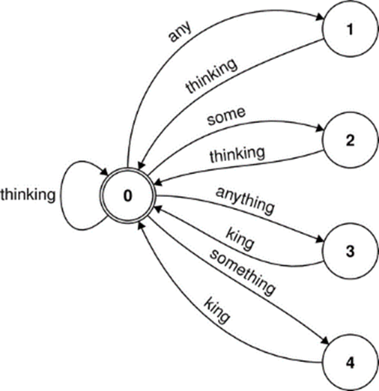
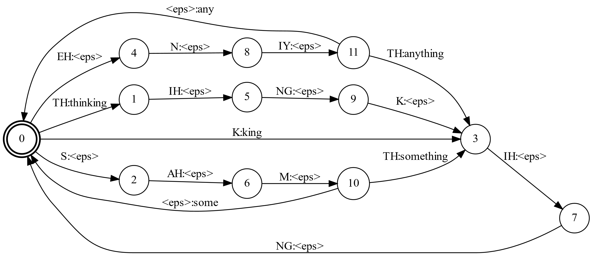
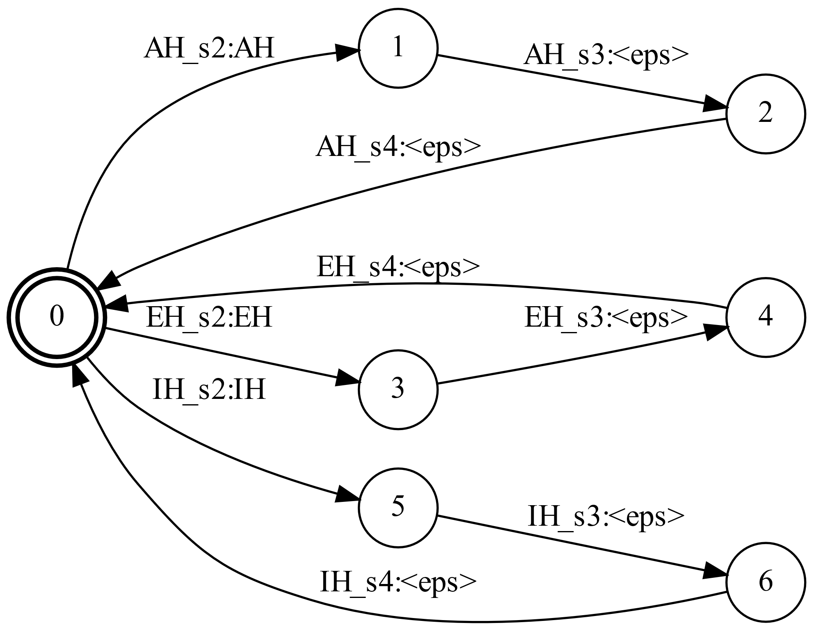
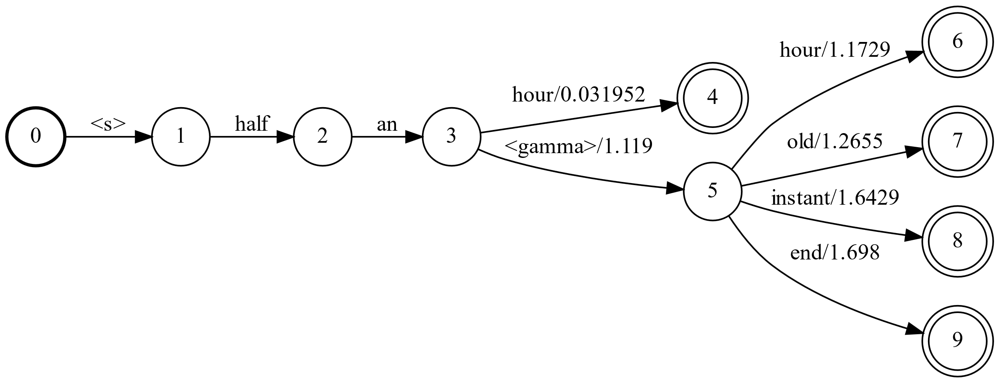

# Speech Decoding

## Overview  

The acoustic model scores sequences of acoustic model labels. For every time frame of input data, it computes the relative score for every label. Every sequence of labels has an associated score.

The language model scores sequences of words. To every valid sequence of words in the vocabulary, it assigns a language model score.

The glue that ties the two together is the decoding graph. It is a function that maps valid acoustic label sequences to the corresponding word sequences, together with the language model score.

## Weighted Finite State Transducers


In this course, we will be using some constructs from the field of weighted finite state transducers (WFST).

Finite state automata (FSA) are a compact graph structures that encode sets of strings and are efficient to search.

Finite state transducers (FST) are similar, but encode an mapping from one set of strings to another.

Either FSA or FST can be weighted, in which case each element of the set (FSA), or each mapping pair (FST) is associated with a numeric weight.

In this lesson, we explore how the structure of the speech recognition task can be encoded as WFST.


## The Grammar, a Finite State Acceptor

For example, assume we wish to build a trivial speech recognition
system, and the set of all valid phrases consists of the following
five-element set. Such a set is efficiently expressed by a finite state
acceptor (FSA).

> any thinking
> some thinking
> anything king
> something king
> thinking

The complete vocabulary of the system is six words.

> any
> anything
> king
> some
> something
> thinking

An FSA that describes our phrases is shown below. Our phrases are
encoded as paths through the graph, starting at the initial state,
ending at the final state, and including the vocabulary words from the
traversed arcs. The figure follows the usual visual conventions for
these graphs:

    All paths start at the initial state labeled 0, and end at any state with a double circle.
    Arcs between states are directional, and labeled with one word from the vocabulary.
    Acceptors have a single symbol. A transducer would have two symbols, separated by a colon.
    Arc weights are assumed be zero, unless specified otherwise.



To compile this graph with the OpenFST toolkit, we need a symbol table
and a textual description of the graph. The symbol table is a mapping
for the vocabulary between human-readable text and machine-friendly
integers. The vocabulary for our grammar is covered by the following
table. The `<eps>` symbol is special, and will be described later.

```text
Vocabulary.sym
< eps> 0
any 1
anything 2
king 3
some 4
something 5
thinking 6
```

The text representation of the graph consists of a series of arc and
final state definitions. Arc definitions consist of start state, end
state, input label, output label, and an optional weight field. Final
state definitions consist of a state number and an optional weight
field. Our grammar is represented as follows:

```text
Grammar.tfst
0 1 any any
1 0 thinking thinking
0 2 some some
2 0 thinking thinking
0 3 anything anything
3 0 king king
0 4 something something
4 0 king king
0 0 thinking thinking
0 0
```

Note that the initial state of the first arc definition is assumed to be
the initial state for the entire graph, and that we also define it as
the final state with the last entry in the file. Also, the convention
for finite state acceptors is that the input label and output labels be
identical.

To compile the graph, use the fstcompile command.

    Fstcompile --isymbols=vocabulary.sym --osymbols=vocabulary.sym --keep_isymbols --keep_osymbols Grammar.tfst Grammar.fst

## The Pronunciation Lexicon, a Finite State Transducer

For some parts of our speech recognition system, we need to associate sequences of one type of symbol with sequences of another. For example, sequences of words imply sequences of phones, and sequences of phones imply sequences of acoustic model labels.

Phone pronunciations for our six words are shown in the table below. This mapping from words to phone sequences is called a pronunciation lexicon. A finite state transducer that describes the pronunciation lexicon accepts valid sequences of phones as input, and produce sequences of words as output.

| Pronunciation	| Word |
|-------------|------|  
| EH N IY 	| any | 
| EH N IY TH IH NG 	| anything |
| K IH NG 	| king | 
| S AH M 	| some |
| S AH M TH IH NG | something |
| TH IH NG K IH NG | thinking |

One possible way of building such a transducer would be to make a path for every word in the pronunciation lexicon. The first part of this FST might look like this.

```
0 1 EH any
1 2 N <eps>
2 0 IY<eps>
0 3 EH anything
3 4 N <eps>
4 5 IY <eps>
5 6 TH <eps>
6 7 IH <eps>
7 0 NG <eps>
0 8 K king
8 9 IH <eps>
9 0 NG <eps>
…
```

Here, we first encounter the epsilon symbol, `<eps>`. When building the input or output string for a path through the graph, epsilon symbols are ignored. So, the path through states 0, 1, 2, 0 might seem like the output symbol sequence is any, `<eps>`, `<eps>`. But, in reality it consists only of the single symbol “any”.

A close inspection of the lexical FST structure above reveals some redundancy in the graph. For instance, one valid phone at the beginning of the input sequence is “EH”, but that is encoded with two separate arcs, going to two separate states. We can eliminate one of these states by accepting EH as an input, but associating it with an `<eps>` output and delaying the output of either word “any” or “anything.”

```
0 1 EH any<eps>
1 2 N ~~<eps>~~any
2 0 IY<eps>
0 3 EH anything
31 4 N ~~<eps>~~anything
4 5 IY <eps>
5 6 TH <eps>
6 7 IH <eps>
7 0 NG <eps>
0 8 K king
8 9 IH <eps>
9 0 NG <eps>
…
```

The entry for “any” is encoded in the state path 0, 1, 2, 0, and the entry for “anything” is through the path 0, 1, 4, 5, 6, 7, 0. The state 3 is eliminated, as well as one of the redundant arcs. Furthermore, state 1 now has two arcs that share an N input symbol, and the procedure can be repeated. This process, where the graph is compressed by merging arcs that start in the same state and share an input label, is called determinization. It ensures every unique input string prefix maps to a unique state of the graph. Its complementary algorithm, FSTminimization, works analogously with the suffixes of the string. Both determinization and minimization can compact the graph structure without affecting the set of strings described by the FSA, and it would be difficult to construct a reasonable decoding graph without them.

A compact pronunciation lexicon FST that represents our pronunciation lexicon is shown here. It is a bit more complex than the grammar FST from the previous lesson. One possible path through this FST is through the state sequence 0, 4, 8, 11, 3, 7, 0. This corresponds with an input string of “EH N IY TH IH NG” and an output string of “`<eps>` `<eps>` `<eps>` anything`< eps>` `<eps>`”. Because the `<eps>` symbols can be ignored, it is clear that this path represents one of the entries from the pronunciation lexicon above.



A transducer, like this one, may have more than one path that accepts the same input string. If these paths are associated with different output strings, the transducer is said to be non-functional. This is the algebraic equivalent of an expression mapping a single input to two different outputs.

In the graph above, there is a path through states 0, 4, 8, 11, 1, 5, 9, 3, 7, 0 that maps “EH N IY TH IH NG K IH NG” to “any thinking”. There is another path through states 0, 4, 8, 11, 3, 7, 0, 3, 7, 0 that maps the same phone sequence to “anything king”. Because a function should associate a unique output with every input, and this transducer fails that property, it is non-functional.

Although non-functional FST are valid structures, not all graph algorithms can be applied. For instance, standard determinization algorithms can not be applied to a non-functional FST.

In speech recognition, non-functional transducers arise from one of these situations:

    Homophones in the pronunciation lexicon.
    Sequence homophones, as the “any thinking” and “anything king” example above.
    Acoustic model state sequences that don’t map to unique phone sequences.

The first two cases are addressed by using a technique involving "disambiguation symbols," and dealing with the third case is beyond the scope of this course.

Disambiguation symbols modify each pronunciation in the lexicon to end with an artificial phone. With these symbols added, our pronunciation lexicon would become:

```text
Phone Sequence	Word
EH N IY #0 	any
EH N IY TH IH NG #0 	anything
K IH NG #0 	king
S AH M #0 	some
S AH M TH IH NG #0 	something
TH IH NG K IH NG #0 	thinking
```

This is enough structure to break the sequence homophone example: “EX N IY #0 TH IH NG K IH NG #0” is unambiguously “any thinking,” and “EX N IY TH IH NG #0 K IH NG #0” is “anything king.” For the case where the pronunciation lexicon contains true homophones, each one would receive a unique symbol, starting with #0 and proceeding through #1, #2, #3, and so on. With proper use of disambiguation symbols, any lexical FST can be made functional.

Another common way to address the problem of determinizing a non-functional FST is to transform it into an FSA. This process is known as encoding the FST. To encode an FST into an FSA, the input and output symbol of every arc in the graph is fused into a single symbol. Because the notion of input and output has been eliminated, the result is an FSA that describes a sequence of input/output pairs. Because it is a FSA, it is necessarily determinizable. After determinizing the encoded FSA, the encoding process can be reversed.  


## The HMM State Transducer, a Finite State Transducer  

The HMM state sequence transducer H maps sequences of acoustic model states to sequences of phone labels. As with the pronunciation lexicon, the desired mapping can be described with a table.

| Acoustic Label | Sequence 	| Phone |  
|----------------|------------|-------|
| AH_s2 AH_s3 AH_s4 	| AH |
| EH_s2 EH_s3 EH_s4 	| EH |
| IH_s2 IH_s3 IH_s4 	| IH |
| IY_s2 IY_s3 IY_s4 	| IY |
| K_s2 K_s3 K_s4 	    | K
| N_s2 N_s3 N_s4 	    | N
| NG_s2 NG_s3 NG_s4 	| NG |
| S_s2 S_s3 S_s4 	    | S
| TH_s2 TH_s3 TH_s4 	| TH |
| M_s2 M_s3 M_s4 	    | M
| #0 	                | #0 |

The structure of our model is that each phone is associated with a sequence of three acoustic labels. These represent the beginning, middle, and end of the phone's acoustic realization. Larger acoustic models typically have many more acoustic labels, capturing the way each phone's acoustic realization changes depending on its neighboring sounds in the sequences. These context dependent models are beyond the scope of this course.

Note that the table should include the disambiguation symbols from the lexical transducer. The H transducer should be constructed in such a way that any disambiguation symbols embedded in the phone sequence should be mapped to corresponding symbols in the acoustic label sequence.

An visualization of the HMM transducer covering three of the ten phones in our toy example is shown below. Each phone model consists of a loop, where the state names, such as AH_s2, occur on the input side in sets of three, and the corresponding phone names, such as AH, occur on the output side. The other seven phones would have a similar structure, adding one loop per phone.

 

## Weighted Finite State Transducers and Acceptors  

A weighted finite state automaton (WFSA) is a FSA that assigns a score to every sequence that it accepts. Every string that the automaton accepts is mapped to a score. A lexical FST might be augmented with weights to encode the relative probability of each word's pronunciation variants. A grammar FSA can be augmented with weights to encode the relative probability of the word sequences it represents.  

## The ngram Grammar Transducer, a More Complex Grammar WFST

An ngram language model, such as those developed in Module 4, can be approximately expressed as a WFSA that accepts strings of words, interspersed with special non-word tokens that indicate when the language model context experiences a backoff. As an example, we will examine a small part of a transducer that encodes the following ngrams:

```text
-0.03195206 half an hour
-1.020315 half an -1.11897
-1.172884 an hour
-1.265547 an old
-1.642946 an instant
-1.698012 an end
```

The portion of the WFST that these ngrams encode is shown here:  



In this graph, it is given that the first three tokens are the start token, followed by “half” and “an,” and the graph computes the weight for the next word. Because “half an hour” is quit a common phrase in English, it has it’s own path from state 3 to state 4, which encodes the probability of “hour” following the “half an” bigram. If any words followed “hour” here, they would have an “an hour” context.

Other words are allowed to follow “half an,” even though there is no trigram for them in the language model definition. Whereas state 3 represents the “half an” context, the state 5 represents only a context of “an”. The weight associated with contracting the context in this way is given by the backoff weight for the “half an” grammar in the definition. After taking this penalty, the model allows for four words in the context of “an”. You can see that one of these words is hour, because “an hour” is also quite common in English.  

## Graph Composition

The final algorithm we are interested in is FST composition. Just as with algebraic function composition, FST composition is merging two FST by feeding the output of one into the input of the second. If the first WFST maps string A to string B with weight x, and the second maps string B to string C with weight y, then the composed FST will map string A to string C with weight x+y.  

## The Decoding Graph  

We desire a decoding graph that can unify sequences of acoustic model states and sequences of words.

In lesson 2 and 3, we saw how the structure of the speech recognition problem can be encoded in WFST:

1. The grammar G can be a FSA that encodes a flat set of phrases, or a WFSA that assigns weights to the phrases like a language model does.
2. The pronunciation lexicon L is a WFST that maps sequences of phones (with disambiguation symbols) to sequences of words.
3. The HMM transducer H that maps from sequences of HMM states (senone labels) to sequences of HMM model names (phones, or triphones).

Not covered in this course, but common to many systems, is a fourth WFST that maps from sequences of triphone models to sequences of phones, and is called the context transducer C.

To associate sequences of acoustic model states with sequences of words, the transducers H, C, L, and G should be consecutively applied. This could be accomplished at runtime in the decoder, but if this composition is done offline as a preprocessing step, then the decoder becomes much simpler.

When fully composed, the HCLG of our toy example looks like this:   

  

The general practice is to compose from right to left, and determinize and minimize the graph after each individual composition. In the upcoming lab assignment, we have pre-compose H, C, and L, and all that is left is to create the G graph, and compose it with the given HCL WFST.

Recall that the graph G has the language model backoff symbols on its input side. The HCL passes these symbols through as they occur. As a result, the composed HCLG will have these symbols as input.

Recall also that because the L graph contains pronunciation disambiguation symbols, the HCL graph has these as well on its input side. The fully composed HCLG will also have these symbols as input.

Because the decoder doesn't need this information, these symbols are usually replaced with the epsilon symbol, indicating that traversing these arcs doesn't affect the input string.  

## The Search  


Speech recognition decoding is the process of finding the word sequence that jointly maximizes the language model score and acoustic model score. A sequence of acoustic states is assigned an acoustic model score by the acoustic model, and a language model score by path it describes through the decoding graph.

It is a path search algorithm through the decoding graph, where the score of the path is the sum of the score given to it by the decoding graph, and the score given to it by the acoustic model. Due to the nature of our models, we can use a simple dynamic programming approach to find the shortest path. If the best path passes through state S at time T, then it includes the best prefix path ending at time T and state S.

A typical frame synchronous beam search proceeds in three stages. For each time t,

1. Advance each partial hypothesis forward in the graph across arcs that have a non-epsilon input symbol.
   1.  As a result, all the new partial hypotheses that are generated have exactly t input symbols in their path.
    2. If two partial hypotheses collide onto the same state, only keep the higher scoring hypothesis.

2. Eliminate any hypotheses that are “out of beam.” This could mean either keeping the top K hypotheses (where K is the maximum token count), or eliminating any partial hypothesis that has a score more than B worse than the best (where B is the beam width).

3. Advance each of the remaining tokens across arcs with an epsilon input symbol.
    - If two partial hypotheses collide onto the same state, only keep the higher scoring hypothesis.

The important parameters for a pruned search are beam width B and maximum token count K. The beam width insures that partial hypotheses that are far from the current best are abandoned. The maximum token count limits the total amount of work done on every frame.

It is possible that the best overall path has a very low score for some time t, and is discarded by the pruning process. In this case, the beam search algorithm will result in a sub-optimal path. When this happens, we say that the algorithm has produced a search error. It is possible to reduce these errors arbitrarially close to zero by increasing the beam width and maximum token count.


## Quiz  

Question 1

Which of these can most compactly represent a set of strings? (Choose one)

- [ ] Weighted Finite State Transducer   
- [ ] Weighted Finite State Acceptor  
- [ ] Finite State Transducer  
- [ ] Finite State Acceptor  
- [ ] None of the Above  


Question 2

Which component of the decoding graph represents valid sequences of words? (Choose one) 

- [ ] The Grammar
- [ ] The HMM State Transducer
- [ ] The Pronunciation Lexicon
- [ ] None of the Above


Question 3

Which one of the following properties will cause a FST to be non-functional? (Choose one)

- [ ] More than one input string maps to the same output string
- [ ] For at least one path, the path score is negative
- [ ] One input string maps to more than one output string
- [ ] For at least one path, the input string and output string are identical


Question 4

Which component of the decoding graph generally needs disambiguation symbols to prevent non-functionality? (Choose one)

- [ ] The Grammar
- [ ] The HMM State Transducer
- [ ] The Pronunciation Lexicon
- [ ] None of the Above


Question 5

Which component of the decoding graph describes the HMM structures of the acoustic model? (Choose one)

- [ ] The Grammar
- [ ] The HMM State Transducer
- [ ] The Pronunciation Lexicon
- [ ] None of the Above


Question 6

When successfully applied, which of these algorithms tend to make the resulting structure larger? (Choose all that apply)

- [] Minimization
- [] Determinization
- [] Composition
- [] None of the Above


Question 7

When successfully applied, which of these algorithms tend to make the resulting structure smaller? (Choose all that apply)

- [ ] Minimization
- [ ] Determinization
- [ ] Composition
- [ ] None of the Above


Question 8

During beam search decoding, hypotheses may be discarded if which of the following conditions exist? (Choose all that apply)

- [ ] The token's score falls outside the beam width.
- [ ] There are too many tokens, and this token isn’t one of the N best.
- [ ] The token enters a determinized state.
- [ ] The token enters a minimized state.
- [ ] None of the Above


Question 9

Which of these are standard conventions for WFST? (Choose all that apply)

- [ ] The initial state in the first line of a WFST description is assumed to be the initial state of the graph.
- [ ] Weights are assumed to be zero unless otherwise specified.
- [ ] The final state of the final line of a WFST description is assumed to be the final state of the graph.
- [ ] None of the Above


Question 10

When a path traverses an arc with an epsilon symbol, what does this indicate? (Choose one)

- [ ] The path's string is appended with an epsilon.
- [ ] The path's string is unaffected by this arc.
- [ ] The path's weight is reset to zero.
- [ ] None of the Above


## Lab 


Lab for Module 5: Decoding
Required files:

1. [`HCL.fst`](./HCL.fst)

This is a finite state transducer that maps sequences of context independent phone states (acoustic model labels) to sequences of words. The lexicon has 200,000 words.

HCL.fst has not been determinized. Instead, it has been prepared to make composition with a language model WFST as efficient as possible.

This FST has disambiguation symbols on its input side. They ensure that every unique input sequence has a unique output sequences, regardless of homonyms. This preserves the functional nature of the transducer, which makes determinization possible.

It is expected that the language model contains "<gamma>" symbols on its input side, which represent the backoff transitions of the language model. This HCL.fst contains arcs with "<gamma>" labels on the input and output so these transitions will also be present on the input side of the fully composed graph. If it did not, then the composed graph would not be functional, and determinization would be impossible.

2. `DecodingGraph.fst`

This is the result of compiling HCL.fst with a trigram language model, and applying a series of transformations to remove both disambiguation and language model backoff symbols, as well as to compact the structure into fewer arcs.

3. `H.FST.isym` and `L.fst.osym`

These are the input and output symbol tables that should cover the input and output of HCL.fst, DecodingGraph.fst, and any other decoding graph you build in this lab.

3. `StaticDecoder.py`

This is a simple Python-based beam decoder. It relies on loading a CNTK acoustic model, a WFST decoding graph, and pre-processed acoustic features.


#### Instructions:

1. Run the StaticDecoder.py to decode the test data using the provided DecodingGraph.fst and the Experiments/lists/feat_test.rscp generated in lab 2.
    - The provided DecodingGraph.fst is in OpenFst format, but the decoder expects it to be in text format. Create DecodingGraph.fst.txt using the OpenFST fstprint tool.
    - Run the provided decoder with default parameters on the test data, using any acoustic model built in Section 3 of this class.
    - Measure the word error rate of the decoder's output with respect to the given reference text, using the word error rate module from Section 1 of this class.

2. Create a new decoding graph using a language model you have trained in Module 4 of this class.
    - Convert the ARPA format language model to its FST approximation. The arpa2fst.py tool is provided for this purpose.
    - Compose your new G.fst with the given HCL.fst.
    - Process the graph using a mixture of label pushing, encoding, decoding, minimization, and determinization. As part of this process, all disambiguation symbols and language model backoff symbols should be manually converted into "<eps>".
    - Use the resulting HCLG.fst in place of DecodingGraph.fst to repeat Assignment 2 above.

3. Measure the time-accuracy tradeoff of the decoder.
    - Run the decoder with the provided DecodingGraph.fst two more times: once with the beam width decreased by a factor of ten, and once with the beam width increased by a factor of ten.
    - What do you observe about the relationship between decoding speed and word error rate? What do you expect if the beam width was increased to the point that no pruning occurred?
    
Supplementary Material:

https://cs.nyu.edu/~mohri/pub/hbka.pdf

This chapter from the Springer Handbook on Speech Processing and Speech Communication has more information than you will need to complete the labs, but may be interesting for the motivated student. Section 3 details some standard algorithms, and Section 4 describes how the WFST framework is typically applied for the speech recognition task.
