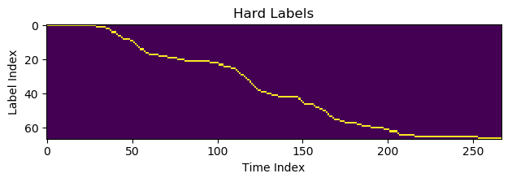
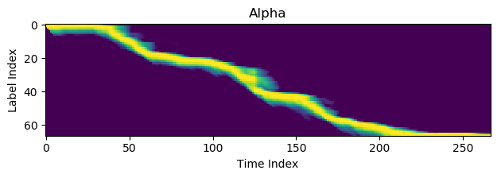
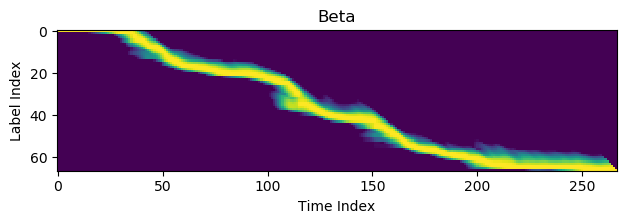
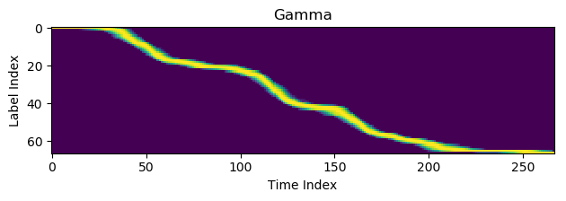

# Module 6: End-to-End Models

[Previous](../M5_Decoding/)

## Table of Contents
- [End-to-End Models](#6-end-to-end-models)
- [Improved Objective Functions](#improved-objective-functions)
- [Sequential Objective Function](#sequential-objective-function)
- [Connectionist Temporal Classification](#connectionist-temporal-classification)
- [Sequence Discriminative Objective Functions](#sequence-discriminative-objective-functions)
- [Grapheme or Word Labels](#grapheme-or-word-labels)
- [Encoder-Decoder Networks](#encoder-decoder-networks)
- [Quiz](#quiz)

## Improved Objective Functions  

Recall from Module 3 that he most common objective function used for training neural networks for classification tasks is frame-based cross entropy. With this objective function, a single one-hot label $z\left\lbrack t \right\rbrack$ is specified for every input frame of data t, and compared with the softmax output of the acoustic model.

If we define

$$z\lbrack i,t\rbrack = \left\lbrace \begin{matrix} 1 & z\lbrack t\rbrack = i, \\ 0 & \text{otherwise} \end{matrix} \right.
$$

then the cross-entropy against the softmax network output $y[i,t]$ is as follows.

$$L = - \sum_{t = 1}^{T} \sum_{i = 1}^{M} z\left\lbrack i,t \right\rbrack\log\left( y\left\lbrack i,t \right\rbrack \right)
$$

Using a frame-based cross entropy objective function implies three
things that are untrue for the acoustic modeling task.

That every frame of acoustic data has exactly one correct label.
The correct label must be predicted independently of the other frames.
All frames of data are equally important.
This module explores some alternative strategies that address these modeling deficiencies.

## Sequential Objective Function

Acoustic modeling is essentially a sequential task. Given a sequence of acoustic feature vectors, the task is to output a sequence of words. If a model can do that well, the exact alignment from the feature vectors to acoustic labels is irrelevant. Sequential objective functions train models that produce the correct sequence of labels, without regard their relative alignment with the acoustic signal. Note that this is a separate feature from the sequential discriminative objective functions, such as maximum mutual information (MMI), discussed in Module 3.

Sequential objective functions allow the training labels to drift in time. As the model converges, it finds a segmentation that explains the labels and obeys the constraint that the ground-truth sequence label sequence is unchanged.

Whereas the frame-based cross entropy objective function requires a sequence of labels $z\lbrack t\rbrack$ that is the same length as the acoustic feature vector sequence, sequential objective functions specify a sequence of symbols $S=\lbrace s_{0},s_{1},\ldots,\ s_{K - 1} \rbrace$ for each utterance. An alignment from the T acoustic features to the K symbols is denoted by $\pi\left\lbrack t \right\rbrack$. The label for time $t$ is found in the entry of $S$ indexed by $\pi[t]$.

The objective function can be improved by moving from a frame-based to a segment-based formulation. Whereas frame-based cross entropy assigns labels to frames, sequence-based cross entropy specifies the sequence of labels to assign, but is ambivalent about which frames are assigned to the labels. Essentially, it allows the labels to drift in time. As the model trains, it finds a segmentation that is easy to model, explains the data, and obeys the constraint that the ground-truth sequence of labels should be unchanged. Instead of using the alignment $z\left\lbrack i,t \right\rbrack$, we produce a pseudo-alignment $\gamma\left\lbrack i,t \right\rbrack$ that has the labels in the same order as the reference, but is also a function of the current network output. It can be either a soft alignment or a hard alignment. It is easily computed by turning the alignment sequence into an HMM and using standard Viterbi (hard alignment) or forward-backward (soft alignment) algorithms.

$$L = \ {P\left( S \middle| \pi \right)P\left( \pi \right)} = {P\left( \pi \right)\prod_{t}^{}{y\left\lbrack \pi\left( t \right),t \right\rbrack}} - \sum_{i}^{}{\gamma\left\lbrack i,t \right\rbrack\log\left( y\left\lbrack i,t \right\rbrack \right)}
$$

Let $\overset{\overline{}}{z}\left\lbrack k \right\rbrack$ represent the $K$ symbols in the label sequence, after duplicates have been removed. Define a HMM that represents moving through each of these labels in order. It always begins in state zero, always ends in state $K - 1$, and will emit symbol $\overset{\overline{}}{z}\lbrack k\rbrack$ in state $k$. The soft alignment is the product of a forward variable $\alpha$ and a backward variable $\beta$. The nonzero values are given by:

$$\gamma\left\lbrack \overset{\overline{}}{z}\left\lbrack k \right\rbrack,t \right\rbrack = \alpha\left\lbrack k,t \right\rbrack\beta\lbrack k,t\rbrack
$$

The forward recursion computes the score of state k given the acoustic evidence up to, and including, time $t$. Its initial state is the model's prediction for the score of the first label in the sequence.

$$\alpha\lbrack k,0\rbrack = \left\lbrace
    \begin{matrix} 
    y\left\lbrack \overset{\overline{}}{z}\left\lbrack k \right\rbrack,\ 0 \right\rbrack & k = 0, \\ 
    0 & \text{otherwise}
    \end{matrix} \right.
$$

The recursion moves forward in time by first projecting this score through a transition matrix $T$ with elements $t_{\text{ij}}$, and then applying the model's score for the labels.

$$\alpha\left\lbrack k,t \right\rbrack = y\left\lbrack \overset{\overline{}}{z}\left\lbrack k \right\rbrack,t \right\rbrack\sum_{j}^{}{t_{kj}\alpha\left\lbrack j,\ t - 1 \right\rbrack}
$$

The transition matrix $T$ simply restricts the model topology to be left-to-right.

$$t_{\text{ij}} = \left\lbrace \begin{matrix} 
1 & i = j, \\ 
1 & i = j + 1, \\ 
0 & \text{otherwise} \end{matrix} \right.
$$

An example of this forward variable computed on an utterance about 2.6 seconds long, and containing 66 labels, is shown below. Yellow indicates larger values of the forward variable, and purple represents smaller values. Structures depart the main branch, searching possible paths forward in time. Because the alpha computation for a particular time has no information about the future, it is exploring all viable paths with the current information.

The backward recursion computes the score of state k given acoustic evidence from the end of the segment back to, but not including, the current time t. Its initial state at time T - 1 doesn't include any acoustic evidence and is simply the final state of the model.

$$\beta\left\lbrack k,T - 1 \right\rbrack = 1 
$$

The recursion applies the appropriate acoustic score from the model, and then projects the state backward in time using the transpose of the transition matrix $T$.

$$\beta_{k}\left\lbrack t \right\rbrack = \sum_{j}^{}{t_{jk}\beta\left\lbrack j,t + 1 \right\rbrack}y\lbrack\overset{\overline{}}{z}\lbrack j\rbrack,t + 1\rbrack\backslash n 
$$

When the forward and backward variables are combined into the gamma variable, each time slice contains information from the entire utterance, and the branching structures disappear. What is left is a smooth alignment between the label index and time index.

When the forward and backward variables are combined into the $\gamma$ variable, each time slice contains information from the entire utterance, and the branching structures disappear. What is left is a smooth alignment between the label index and time index.

## Connectionist Temporal Classification

Connectionist Temporal Classification (CTC) is a special case of sequential objective functions that alleviates some of the modeling burden that exists cross-entropy. One perceived weakness of the family of cross-entropy objective functions is that it forces the model to explain every frame of input data with a label. CTC modifies the label set to include a “don't care” or “blank” symbol in the alphabet. The correct path through the labels is scored only by the non-blank symbols. If a frame of data doesn't provide any information about the overall labeling of the utterance, a cross-entropy based objective function still forces it to make a choice. The CTC system can output “blank” to indicate that there isn't enough information to discriminate among the meaningful labels.

$$L = \ \sum_{\pi}^{}{P\left( S \middle| \pi \right)P\left( \pi \right) = \sum_{\pi}^{}{P\left( \pi \right)\prod_{t}^{}{y\left\lbrack \pi\left( t \right),t \right\rbrack}}}
$$

## Sequence Discriminative Objective Functions

Module 3 introduced an entirely different set of objective functions, which are also sometimes referred to as sequential objective functions. But, there are sequential in a different respect than the one considered so far in this module.

In this module, “sequential objective function” means that the objective function only observes the sequence of labels along a path, ignoring the alignment of the labels to the acoustic data. In module 3, “sequence based objective function” meant that the posterior probability of a path isn't normalized against all sequences of labels, but only those sequences that are likely given the current model parameters and the decoding constraints.

For instance, recall the maximum mutual information objective function:

$$F_{\text{MMI}} = \sum_{u}^{}{\log\frac{p\left( X_{u} \middle| S_{u} \right)p\left( W_{u} \right)}{\sum_{W'}^{}{p\left( X_{u} \middle| S_{W'} \right)p(W^{'})}}} 
$$

Maximizing the numerator will increase the likelihood of the correct word sequence, and so will minimizing the denominator. If the denominator were not restricted to valid word sequences, then the objective function would simplify to basic frame-based cross entropy.

To minimize confusion, we prefer to refer to objective functions that produce hard or soft alignments during training as _sequence training_, and those that restrict the set of competitors as _discriminative training_. If both features are present, this would be _sequence discriminative training_.

## Grapheme or Word Labels

Deriving a good senone label set on a new task is labor intensive and requires skill and linguistic information. One needs to know the phonetic inventory of the language, a model of coarticulation effects, a pronunciation lexicon, and have access to labeled data to drive the process. Consequently, although senone labels match the acoustic representation of speech, it is not always desirable to use them as acoustic model targets.

Graphemes are a simpler alternative that can be used in place of senones. Whereas senones are related to the acoustic realization of the language sounds, graphemes are related to the written form. The table below illustrates possible graphemic and phonemic representations for six common words.

| Word	| Phonemic Representation	| Graphemic Representation  |
| ------|-----------------------|----------------------------  |
| any	| EH N IY	|   A N Y       |
| anything	| EH N IY TH IH NG	| A N Y T H I N G
| king	| K IH NG	| K I N G | 
| some	| S AH M	| S O M E  |
| something	| S AH M TH IH NG	| S O M E T H I N G |
| thinking	| TH IH NG K IH NG	| T H I N K I N G   |

The grapheme set chosen for this example are the 26 letters of the English alphabet. The advantage of this representation is that it doesn't require any knowledge about how English letters are expressed as English sounds. The disadvantage is that these rules must now be learned by the acoustic model, from data. As a result, graphemic systems tend to produce worse recognition accuracy than their senone equivalents, when trained on the same amount of labeled data.

It is possible to improve graphemic system performance somewhat by choosing a more parsimonious set of symbols. We can take advantages of light linguistic knowledge to take advantage of this effect. In English,

- Letter pairs such as “T H” and “N G” are often associated with a single sound. We can replace them with “TH” and “NG” symbols.

- The letter “Q” is often followed by “U.” We can introduce the “QU” symbol.

- The apostrophe doesn't have a pronunciation, but we can have symbols for contraction and plural ends, such as 'T and 'S.

- Some letter sequences are very rare and occur in only a handful of words, such as the double I at the end of Hawaii. Modeling these sequences by a single symbol alleviates modeling burden caused by sparse data.

An extreme example of this is to eliminate graphemes altogether, and emit whole-word symbols directly. These types of model typically use recurrent acoustic models with a CTC objective function. Although the systems are simple, they are difficult to train properly, and can suffer from a severe out of vocabulary problem. A naively trained system will have a closed set of words that it can recognize, and must be retrained to increase the vocabulary size. Addressing this limitation is an area of active research.

A grapheme decoder, analogous to the decoder used in phoneme based systems, can often improve recognition results. Its decoding network maps from sequences of letters to sequences of words, and a search is performed to determine the path that corresponds to the best combined language model and grapheme model scores.

## Encoder-Decoder Networks  

Whereas most speech recognition systems employ a separate decoding process to assign labels to the given speech frames, an encoder-decoder network uses a neural network to recursively generate its output.

Encoder-decoder networks are common in machine translation systems, where the meaning of text in the source language must be transformed to an equivalent meaning in a target language. For this task, it is not necessary to maintain word order, and there generally isn't a one-to-one correspondence between the words in the source and target language.

When this concept is applied to speech recognition, the source language is the acoustic realization of the speech, and the target language is its textual representation.

Unlike the translation application, the speech recognition task is both a monotonic and one to one mapping from each spoken word to its written form. As a result, the encoder-decoder networks are often modified when used in a speech recognition system.

In its basic form, the encoder part of the network summarizes an entire segment as one vector, passing a single vector to the decoder part of the network, which should stimulate it to recursively produce the correct output. Because this sort of long-term memory and summarization is at the limit of what we can achieve with recurrent networks today, the structure is often supplemented with a feature known as an attention mechanism. The attention mechanism is an auxiliary input to each recurrent step of the decoder, where the decoder can essentially query, based on its internal state, some states of the encoder network.

The decoder network is trained to recursively emit symbols and update its state, much like a RNN language model. The most likely output given the states of the encoder network is typically found using a beam search algorithm against the tree of possible decoder network states.

## Quiz

Test your understanding of end-to-end and sequence models. Select your answers and press **Check answers** &mdash; correct options are highlighted and a short explanation appears for each question.

<form id="srq-form" onsubmit="return false;">
<fieldset class="srq-q" data-type="multi" data-correct="0,1,2">
  <legend>Question 1</legend>
  
Frame-based cross-entropy training implicitly assumes which things that are untrue for acoustic modeling? (Choose all that apply)

  <label><input type="checkbox" name="q1" value="0"> Every frame of data has exactly one correct label</label>
  <label><input type="checkbox" name="q1" value="1"> Each label is predicted independently of the other frames</label>
  <label><input type="checkbox" name="q1" value="2"> All frames of data are equally important</label>
  <label><input type="checkbox" name="q1" value="3"> The model must emit a blank symbol</label>
  
Frame cross entropy assumes each frame has one label, predicted independently, with all frames equally important &mdash; all three are untrue for speech.

</fieldset>
<fieldset class="srq-q" data-type="single" data-correct="0">
  <legend>Question 2</legend>
  
CTC modifies the label set by adding which special symbol? (Choose one)

  <label><input type="radio" name="q2" value="0"> A &ldquo;blank&rdquo; / &ldquo;don't care&rdquo; symbol</label>
  <label><input type="radio" name="q2" value="1"> A start-of-sentence tag</label>
  <label><input type="radio" name="q2" value="2"> A disambiguation symbol</label>
  <label><input type="radio" name="q2" value="3"> An epsilon weight</label>
  
CTC adds a <strong>blank</strong> symbol so a frame that carries no discriminative information need not commit to a real label.

</fieldset>
<fieldset class="srq-q" data-type="single" data-correct="1">
  <legend>Question 3</legend>
  
How do sequential objective functions differ from frame-based cross entropy? (Choose one)

  <label><input type="radio" name="q3" value="0"> They require an exact frame-to-label alignment</label>
  <label><input type="radio" name="q3" value="1"> They score the correct label sequence regardless of alignment (labels may drift in time)</label>
  <label><input type="radio" name="q3" value="2"> They only apply to images</label>
  <label><input type="radio" name="q3" value="3"> They ignore the acoustic model</label>
  
Sequential objectives care about the <strong>sequence</strong> of labels, letting the alignment drift, rather than fixing a label per frame.

</fieldset>
<fieldset class="srq-q" data-type="single" data-correct="0">
  <legend>Question 4</legend>
  
Grapheme acoustic targets are based on what? (Choose one)

  <label><input type="radio" name="q4" value="0"> The written form (letters) of words</label>
  <label><input type="radio" name="q4" value="1"> The acoustic realization (senones)</label>
  <label><input type="radio" name="q4" value="2"> The language model probabilities</label>
  <label><input type="radio" name="q4" value="3"> The FFT bins</label>
  
<strong>Graphemes</strong> relate to the written form of words, so they need no phonetic lexicon &mdash; but the letter-to-sound rules must then be learned from data.

</fieldset>
<fieldset class="srq-q" data-type="single" data-correct="1">
  <legend>Question 5</legend>
  
Compared with senone systems trained on the same amount of data, grapheme systems tend to: (Choose one)

  <label><input type="radio" name="q5" value="0"> Produce better accuracy</label>
  <label><input type="radio" name="q5" value="1"> Produce worse recognition accuracy</label>
  <label><input type="radio" name="q5" value="2"> Require no training</label>
  <label><input type="radio" name="q5" value="3"> Remove the need for a language model</label>
  
Grapheme systems generally give <strong>worse accuracy</strong> for the same data, because the model must learn spelling-to-sound rules itself.

</fieldset>
<fieldset class="srq-q" data-type="single" data-correct="0">
  <legend>Question 6</legend>
  
In sequence training, the soft alignment &gamma; is formed from the product of which two quantities? (Choose one)

  <label><input type="radio" name="q6" value="0"> The forward (&alpha;) and backward (&beta;) variables</label>
  <label><input type="radio" name="q6" value="1"> The mean and the variance</label>
  <label><input type="radio" name="q6" value="2"> The prior and the posterior</label>
  <label><input type="radio" name="q6" value="3"> The gain and the bias</label>
  
&gamma;[k,t] = &alpha;[k,t]&beta;[k,t] &mdash; the product of the forward and backward variables, as in forward-backward.

</fieldset>
<fieldset class="srq-q" data-type="single" data-correct="0">
  <legend>Question 7</legend>
  
An encoder-decoder ASR network is often augmented with which mechanism so the decoder can query encoder states? (Choose one)

  <label><input type="radio" name="q7" value="0"> An attention mechanism</label>
  <label><input type="radio" name="q7" value="1"> A mel filterbank</label>
  <label><input type="radio" name="q7" value="2"> Backoff weights</label>
  <label><input type="radio" name="q7" value="3"> Dithering</label>
  
An <strong>attention</strong> mechanism lets each decoder step query relevant encoder states, easing the summarization burden on the encoder.

</fieldset>
<fieldset class="srq-q" data-type="single" data-correct="0">
  <legend>Question 8</legend>
  
The encoder-decoder decoder typically finds its most likely output using: (Choose one)

  <label><input type="radio" name="q8" value="0"> Beam search over the tree of decoder states</label>
  <label><input type="radio" name="q8" value="1"> The FFT</label>
  <label><input type="radio" name="q8" value="2"> K-means clustering</label>
  <label><input type="radio" name="q8" value="3"> Witten-Bell smoothing</label>
  
The decoder emits symbols recursively; the most likely output is usually found with <strong>beam search</strong> over decoder states.

</fieldset>
<fieldset class="srq-q" data-type="single" data-correct="1">
  <legend>Question 9</legend>
  
A key practical drawback of whole-word CTC systems is: (Choose one)

  <label><input type="radio" name="q9" value="0"> They cannot be trained at all</label>
  <label><input type="radio" name="q9" value="1"> A severe out-of-vocabulary problem (a closed word set; retraining is needed to add words)</label>
  <label><input type="radio" name="q9" value="2"> They require senone labels</label>
  <label><input type="radio" name="q9" value="3"> They ignore the acoustic signal</label>
  
Whole-word models have a <strong>severe OOV problem</strong>: they recognize only a closed set of words and must be retrained to grow the vocabulary.

</fieldset>
<fieldset class="srq-q" data-type="single" data-correct="1">
  <legend>Question 10</legend>
  
Maximum Mutual Information (MMI), introduced in Module 3, is an example of a: (Choose one)

  <label><input type="radio" name="q10" value="0"> Frame-based generative objective</label>
  <label><input type="radio" name="q10" value="1"> Sequence discriminative objective function</label>
  <label><input type="radio" name="q10" value="2"> Feature-extraction step</label>
  <label><input type="radio" name="q10" value="3"> Backoff smoothing scheme</label>
  
MMI restricts the denominator to likely competing word sequences, making it a <strong>sequence discriminative</strong> objective.

</fieldset>

  <button type="button" id="srq-check">Check answers</button>
  <button type="button" id="srq-reset">Reset</button>
  

</form>

